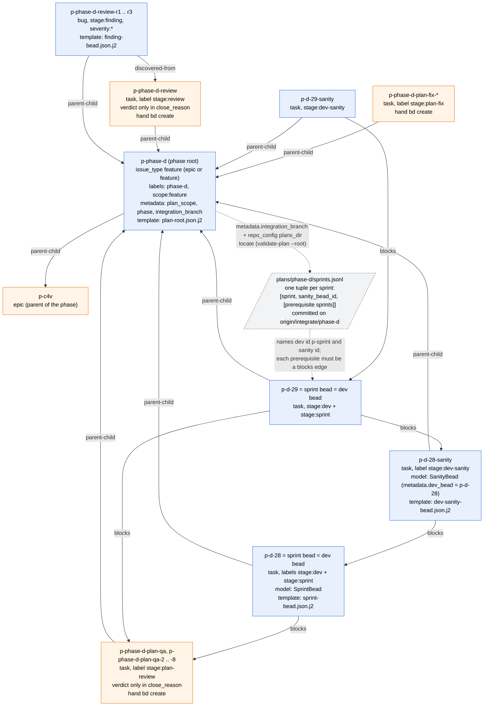
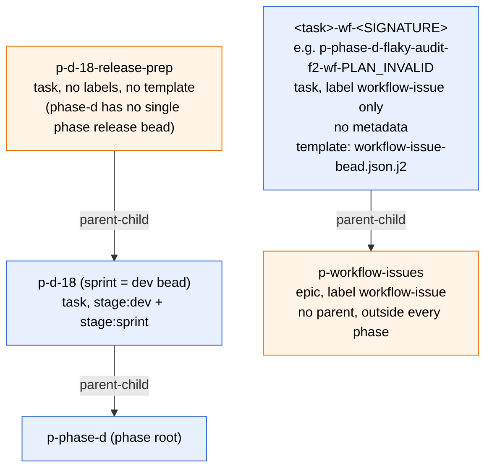

# 1. Phase level, as-is

Source: sc-observability phase-d beads (`p` = `obs`), plus the package as it is
at `main` 775a073 (`atm-beads` `plan-root.json.j2`, `sprint-bead.json.j2`,
`dev-sanity-bead.json.j2`; `atm-bd-orchestration` "Plan Gate", "Phase-End
Review" and `workflow-issue-bead.json.j2`). No formula pours anything today:
every bead below comes from a template plus `bd import`, or from a hand
`bd create`.

## 1a. Root, sprints, plan review, phase-end review

**Legend.** Blue nodes come from a template plus `bd import`. Orange nodes come
from a hand `bd create`. The parallelogram is a committed file, and dashed
arrows to and from it are lookups, not bd edges. Today classification is by
`stage:` label, because dev, sanity, QA, plan review and review are all
`issue_type` task. The cross-sprint edge is the next sprint's dev bead
`blocks` on this sprint's sanity bead (`p-d-29 -> p-d-28-sanity`). There is no
`current-phase.toml` today. The root is passed as `--root`, and
`validate-plan` reads `sprints.jsonl` from `origin/<metadata.integration_branch>`.
A phase-end finding is a child of the root when it spans sprints, and of the
cited dev bead otherwise.

**Open decisions**

1. C8: phase-d's label-based classification is either converted by a one-time
   migration script after phase-d ends, with no runtime label parsing, or
   labels stay a runtime input.
2. C1: plan-review and phase-end review verdicts are either parsed from
   `close_reason` as today, or written as required `verdict` and `round`
   metadata.

## 1b. Release bead and workflow-issue class beads

**Legend.** A workflow-issue class bead groups refusals that share a failure
signature. Assignment templates reuse an existing class bead and append
evidence to its notes, so the class bead carries no edge to the refused task.
The release work in phase-d is an unlabeled task under one sprint, with no
template and no fixed place.

**Open decisions**

1. C7: pick a type for workflow-issue class beads (`chore`, a custom type, or
   `task` plus a schema model) and for a phase release bead, so classification
   needs no catch-all for unlabeled beads like `p-d-18-release-prep`.
