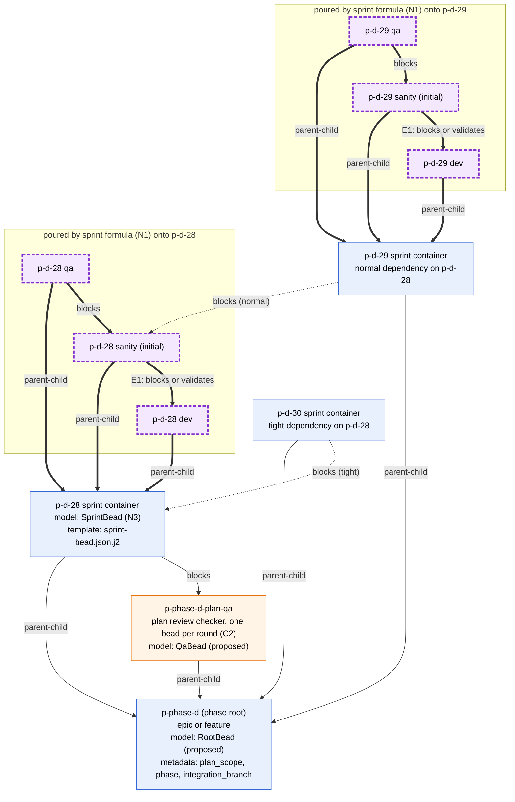
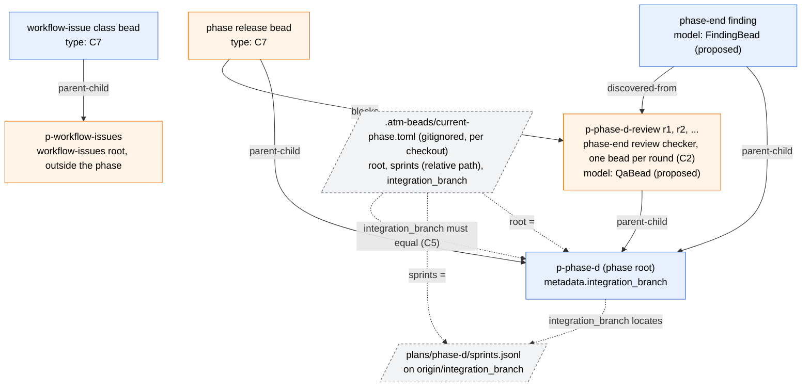

# 2. Phase level, to-be

This is Rand's target model at phase level. The sprint bead becomes a
container. The plan import creates it from a template, as today. At plan
completion, the sprint formula (07) attaches its dev, sanity and QA children.
The container cannot close while any child is open, and blocking findings
become its children (04), so a sprint closes only when every blocking finding
is fixed.

The classes below still say `task` or `epic`, because the type is an open
decision (T1, C7).

## 2a. Root, sprint containers, cross-sprint edges ("normal" and "tight")

**Legend.** Purple dashed nodes and thick arrows are poured by the sprint
formula. Blue nodes come from a template plus `bd import`. The dotted
cross-sprint arrows are `blocks` edges added at plan import from
`sprints.jsonl`. A formula cannot add them (N4).

- **normal**: the dependent sprint container `blocks` on the predecessor's
  initial sanity bead, so it starts as soon as the predecessor's code passes
  its first sanity check.
- **tight**: the dependent sprint container `blocks` on the predecessor's
  sprint container, so it waits until every blocking finding of the
  predecessor is fixed and the container is closed.

Verified on bd 1.3.0: a `blocks` edge on a container hides all of its children
from `bd ready`. So both cross-sprint edges can sit on the dependent container,
not on its dev child. The intra-sprint edges are drawn in detail in 04.

**Open decisions**

1. N2: today `sprints.jsonl` names the sanity bead id at plan time
   (`[sprint, sanity_bead_id, deps]`). The "normal" edge needs that id to
   exist when the plan is imported, so the formula's sanity id has to be
   deterministic and known in advance. Options: the formula takes the id as
   an input, or the tuple names the sprint and the id is derived.
2. N6: `sprints.jsonl` has no way to say "tight". Options: add a fourth tuple
   field (for example `{"tight": ["d-28"]}`), or name the predecessor's sprint
   id instead of its sanity id.
3. Q4: who closes a sprint container, and when (bd never closes a parent
   automatically)? Under "tight", that close is what releases the dependent
   sprint.
4. T1 and C7: the container type. `epic` is listed by `bd ready` once it is
   unblocked, as the phase root is today. A custom type would keep dispatch
   from treating it as work.
5. N1: where the sprint formula's source lives (see 07).

## 2b. Phase-wide beads and the files that point in

**Legend.** Phase-wide checkers and the release bead are made by hand or from
templates. No formula pours them. `current-phase.toml` is the per-checkout
pointer to the root (06). The `REL blocks REV` edge (release waits for the
phase-end review) is drawn as a candidate, not as today's behavior.

**Open decisions**

1. C5: either `current-phase.toml` is the authority for the integration
   branch, or root `metadata.integration_branch` is authoritative and the toml
   is validated against it.
2. C7: the types of the release bead and of workflow-issue class beads.
3. Should the release bead be modeled as a phase child that `blocks` on the
   phase-end review, or left outside the phase graph?
