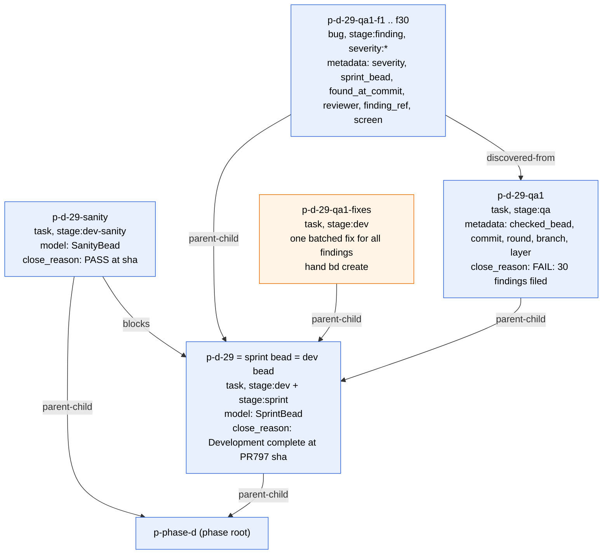
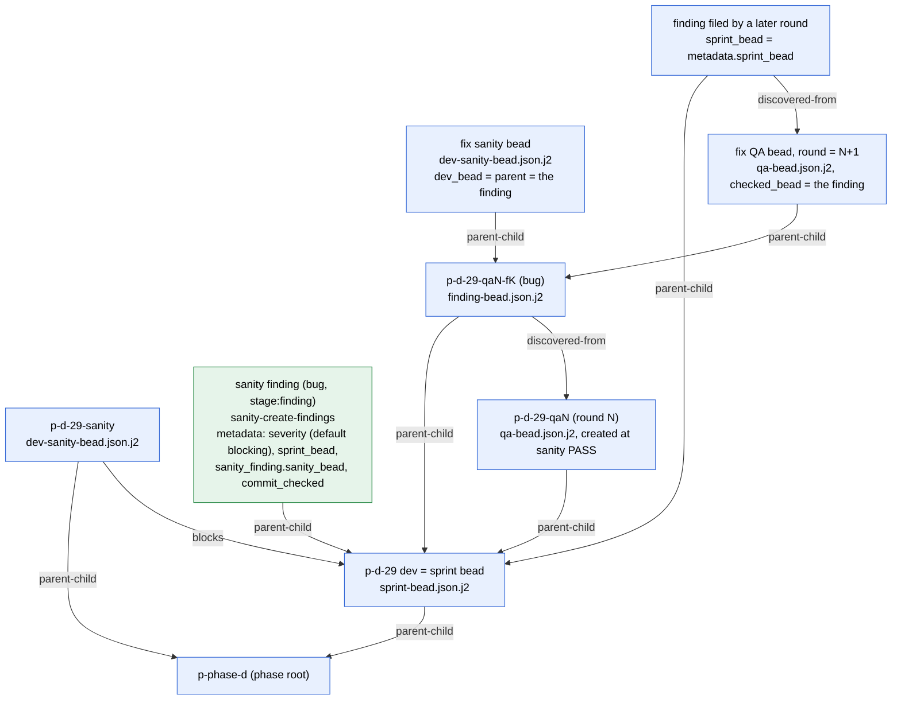

# 3. Sprint level, as-is

No formula pours anything at sprint level today. Every bead comes from a
template, from a package script, or from a hand `bd create`.

## 3a. Phase-d data: sprint p-d-29

**Legend.** These nodes are real phase-d beads (`p` = `obs`). The sprint bead
and the dev bead are the same bead. The sanity bead is a sibling of the dev
bead under the root, not its child. QA has no edge to the sanity bead.
Findings sit flat under the dev bead. Fixes were batched into one bead, with
no triple per finding. Phase-wide counts: QA `blocks` sanity on 365 edges;
finding `discovered-from` QA on 779 edges; no finding is `discovered-from` a
sanity bead; only 2 `validates` edges. The verdict and the pinned sha are
parsed from `close_reason`.

**Open decisions**

1. C8: migrate the label-and-close_reason data once, after phase-d ends, or
   keep parsing it at runtime.
2. C1: the verdict in `close_reason` versus required metadata.

## 3b. What the package templates and scripts create today (main 775a073)

**Legend.** Green comes from a package script, blue from a template. Where the
templates differ from the phase-d data:

- A sanity FAIL files findings with `sanity-create-findings` as children of the
  checked bead (`--parent <checked bead>`). They have no edge to the sanity
  bead; the sanity bead id is only in `metadata.sanity_finding.sanity_bead`.
  The sanity bead stays open on FAIL, because closing it would release
  dependent sprints. The lead reopens the checked bead for the fix.
- The fix is the finding bead itself. No separate fix bead exists. The fixer
  closes the finding, then the lead creates its sanity bead (`parent` and
  `dev_bead` = the finding) and its QA bead (a child of the finding, round =
  the filing QA round + 1).
- A fix-verification QA round files no new findings. A regressed finding is
  reopened with `bd reopen`, so one bead carries several rounds.
- Any finding filed later (the "fix-round findings" box) is a child of the
  original sprint bead (`sprint_bead` follows `metadata.sprint_bead` back), not
  of the finding or QA it came from.
- QA is a child of the bead it checks and `blocks` nothing.
- For a fix sanity bead, `dev-sanity-bead.json.j2` declares both
  `parent-child` and `blocks` to the finding. That is the same pair, and bd
  keeps one type per pair, so only `parent-child` is drawn.

**Open decisions**

1. C4: findings are children of an already-closed checked bead. bd allows the
   child to be added, but the parent's close happened first, so
   `parent-child` groups the findings here and does not act as a closure gate.
2. C2: the reopen and append-notes flow versus one checker bead per round.
3. Q3: sanity-FAIL findings are children of the dev bead today. Do they move
   under the sprint container in the target model?
