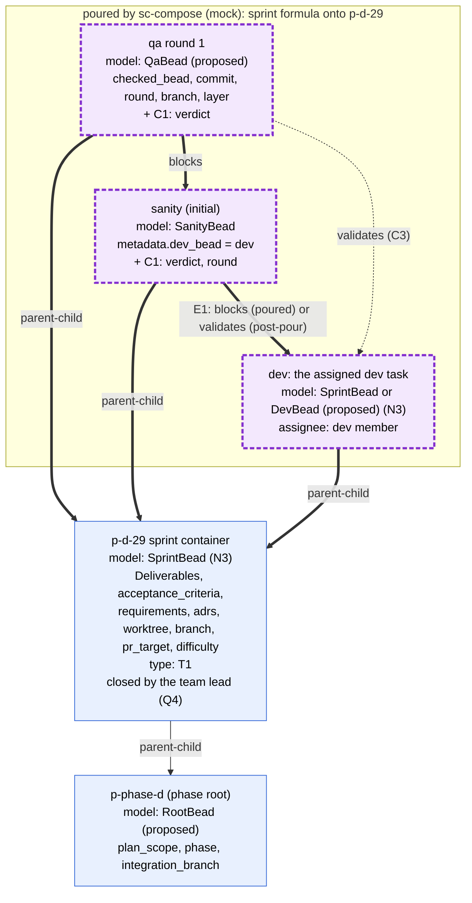
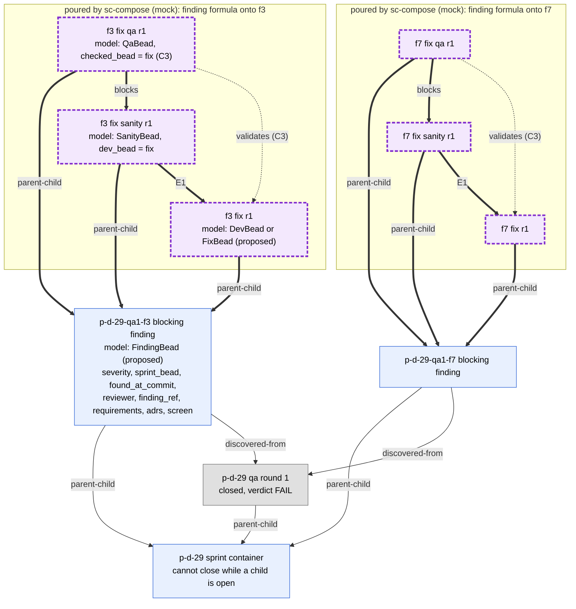
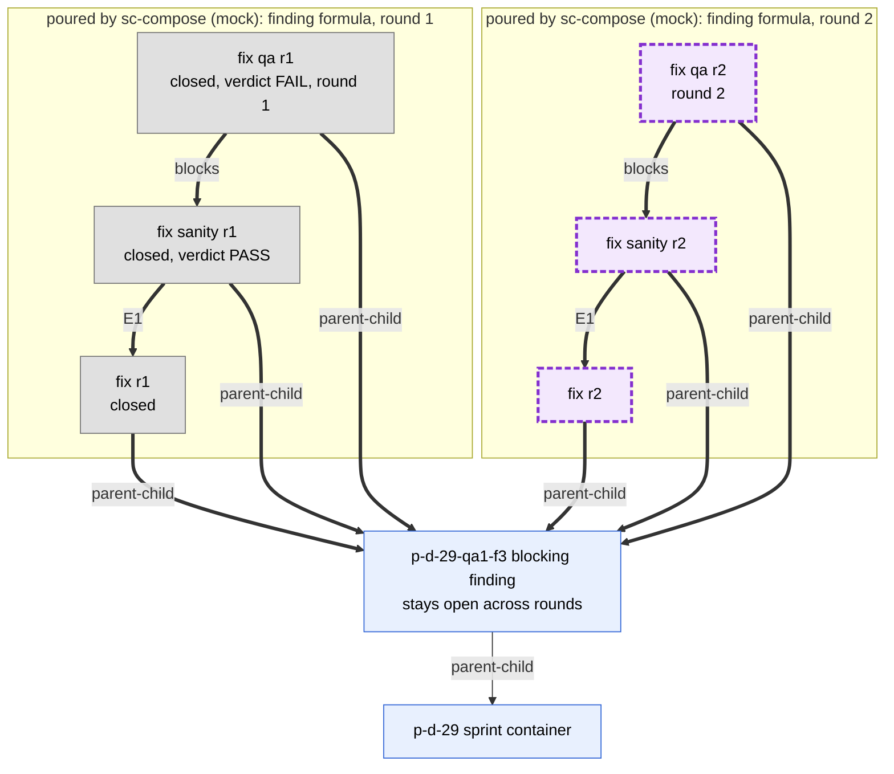
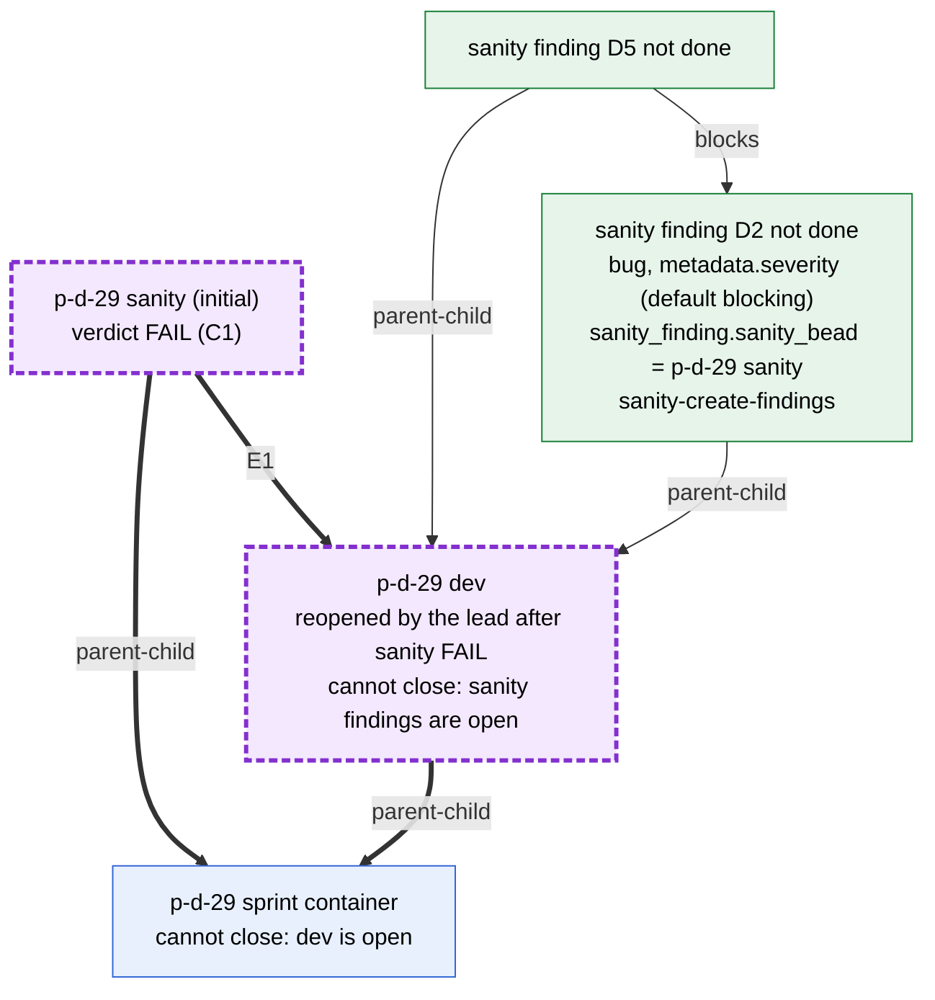

# 4. Sprint level, to-be

In Rand's target model the sprint bead is a container. It cannot close until
every blocking finding is fixed, and the team lead closes it once they are all
closed (Q4, decided). Its children are:

- the dev task that is actually assigned;
- the sanity task (the brief's "severity-task" is read as sanity);
- the QA task.

When QA fails, its blocking findings become `parent-child` children of the
sprint bead. bd refuses to close a parent while a child is open (verified on
bd 1.3.0), and that is what holds the sprint open. Every blocking finding gets
its own fix, sanity and QA beads, independent of every other finding (Q1,
decided). Important and minor findings are filed against the phase, not the
sprint (Q2, decided; drawn in 02b). Model names marked "proposed" do not exist
in `bead_schema.py` yet.

Marking (see the README): thick arrows and purple dashed nodes are poured by
sc-compose (mock for now). Dotted arrows are added by the post-pour step.
Solid arrows and nodes are created by hand, by a template or by a script.

## 4a. The sprint group, with the schema model of each node

**Legend.** `QA blocks sanity` puts QA after sanity. QA-to-dev and
QA-to-sanity are different pairs, so the post-pour step can also give QA a
`validates` edge to the bead it checks. Inside one pair, sanity to dev can
carry only one type (E1, drawn in 05). Under options A and C the formula pours
it as `blocks`. Under option B the formula pours only the sanity bead, and the
post-pour step adds its `validates` edge. The existing `SanityBead` validator
requires a `blocks` edge to `metadata.dev_bead`, so option B would need that
model changed, and option C keeps it unchanged.

**Open decisions**

1. E1: the type of the sanity-to-dev edge: A, B or C (05).
2. N3: does `SprintBead` validate the container or the dev child?
3. C1: are verdict and round required metadata on sanity and QA when they
   close, or derived from status and graph?
4. C3: does QA validate the dev bead, at the same PR head sanity checked, or
   the sanity bead? Is "sanity before QA" its own `blocks` edge, as drawn?
5. T1: classify dev, sanity and QA by `issue_type` (custom types) or by schema
   metadata, with no `stage:` labels.

## 4b. QA FAIL: one independent fix group per blocking finding (Q1, decided)

**Legend.** Grey nodes are closed. QA files each blocking finding from
`finding-bead.json.j2`, and that import creates the finding's `parent-child`
edge to the sprint and its `discovered-from` edge to QA (solid). Each finding
then gets its own poured group, which shares no edge with any other
finding's group: one finding, one fix, as in the old triage/TTL model. The
group is drawn under the finding (see the Q1 note in the README). bd keeps the
finding open until its fix, sanity and QA close, and the finding keeps the
sprint open. If two findings must be fixed in order, the existing
inter-finding `blocks` edge (`blocked_by` in `finding-bead.json.j2`) sits
between the findings, not between their groups.

**Open decisions**

1. C4: severity becomes required `FindingBead` metadata. Under this model,
   `parent-child` to the sprint is a closure gate, not only grouping, because
   the sprint is still open when the finding is filed.
2. C3: does the fix QA check the fix bead or the finding?
3. E1: the fix-sanity-to-fix edge type, the same choice as in 4a.

## 4c. A second fix round: a new group, never a reopen

**Legend.** When fix QA round 1 closes with FAIL, the finding stays open, and
sc-compose pours the finding formula again with `round = 2`. No round-1 bead
is reopened, so its verdict and evidence stay intact. The next round number is
the highest existing round under the finding, plus 1. Today the template
instead reopens the finding with `bd reopen` (03). A fix-round QA files no new
findings, as today.

**Open decisions**

1. C2: one checker bead per round, never reopened (as drawn), versus the
   current reopen flow.
2. C1: with C2, a round's outcome is read from that round's QA `verdict`, not
   from the finding's status.
3. N2: how round-2 ids are made unique (a round suffix input to the formula).

## 4d. Sanity FAIL: the closure chain (Q3, decided)

**Legend.** `sanity-create-findings` (green, a package script) files one
finding per undone deliverable as a child of the checked bead, and adds
`blocks` only between those findings when one depends on another. bd will not
close a bead while any child is open. So the sanity findings hold the dev bead
open, the dev bead holds the sprint container open, and the team lead cannot
close the sprint (Q4) until the dev bead closes. The dev fixes each finding in
place on the reopened dev bead, as today (`dev-fix.xml.j2`). Sanity findings
get no poured fix group.

**Open decisions**

1. C1 and C2: how the sanity FAIL is recorded. Today the sanity bead stays
   open on FAIL and is dispatched again after the fix. Under C2 a new sanity
   bead would be created for the next round.
2. N9: should sanity findings record a `discovered-from` edge to the sanity bead,
   added by the post-pour step or by the script, instead of only
   `metadata.sanity_finding.sanity_bead`? (Today: no such edge exists.)
