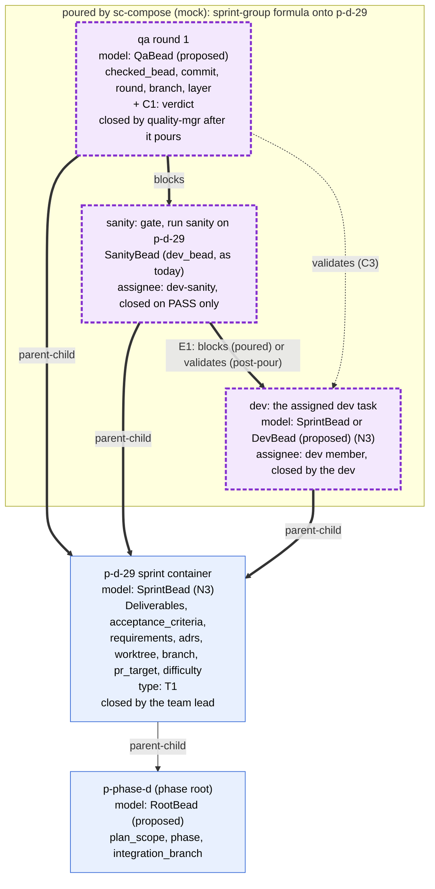
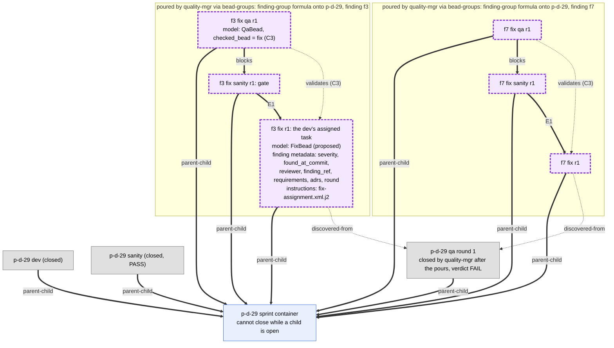
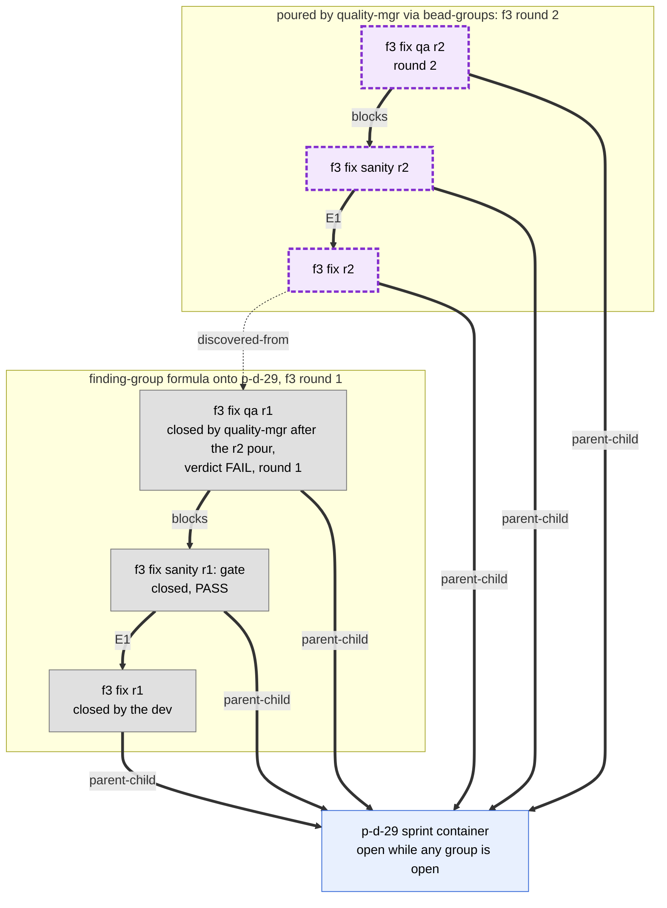
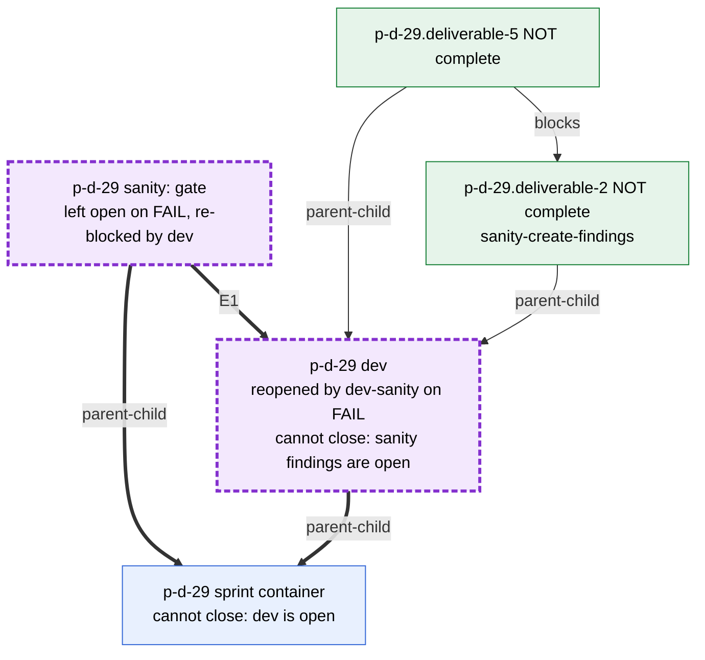

# 4. Sprint level, to-be

In Rand's target model the sprint bead is a container, and every group under
it is flat (ruling of 2026-10-03). The sprint's own group is three sibling
children:

- dev: the dev task that is actually assigned;
- sanity: the sanity task (the brief's "severity-task" is read as sanity);
- qa: the QA task.

They are chained `dev ← sanity ← qa`: sanity waits for dev, and qa waits for
sanity. When QA fails, every blocking finding pours the same shape,
`fix ← sanity ← qa`, as siblings directly under the sprint bead. There is no
finding container and no nested group. The fix bead is the dev's assigned
task. It carries the finding's metadata, and its instructions come from the
fix template (`fix-assignment.xml.j2`). Important and minor findings are plain
finding beads against the phase or its feature bead, never poured, and never
children of the sprint (Q2, decided; drawn in 02b).

bd refuses to close a parent while a child is open (verified on bd 1.3.0). So
the sprint cannot close while any dev, sanity, qa or fix-group bead is open,
and the team lead closes it once every blocking fix group is closed.

Flat one-finding-one-fix is new structure relative to phase-d. There, one
fix bead covered several findings, sat under the sprint or under a finding,
and carried its sanity and QA beads as its own children (03, 3c). Migrating
the phase-d data is post-phase-d work.

Who closes what (decided, 2026-10-03):

| Bead | Closed by | When |
| --- | --- | --- |
| dev, fix | the dev | the work is done |
| sanity (sprint or fix group) | dev-sanity | PASS only. On FAIL dev-sanity reopens the dev or fix bead and leaves sanity open; the dependency edge then re-blocks sanity. |
| qa (sprint or fix group) | quality-mgr | only after it has poured a fix group for each blocking finding and created the important and minor finding beads |
| sprint | the team lead | every blocking fix group is closed (bd refuses while any child is open) |

dev-sanity is one named teammate with one agent prompt,
`plugins/atm-bd-orchestration/agents/dev-sanity.md`. It spawns the subagents
`sc-sanity-jev` and `sc-sanity-llm`.

Model names marked "proposed" do not exist in `bead_schema.py` yet.

Marking (see the README): thick arrows and purple dashed nodes are poured by
sc-compose (mock for now). Dotted arrows are added by the post-pour step.
Solid arrows and nodes are created by hand, by a template or by a script. Both
the pour and the post-pour step run through `scripts/bead-groups` (PR #19).

## 4a. The sprint group, with the schema model of each node

**Legend.** `QA blocks sanity` puts QA after sanity. QA-to-dev and
QA-to-sanity are different pairs, so the post-pour step can also give QA a
`validates` edge to the bead it checks. Inside one pair, sanity to dev can
carry only one type (E1, drawn in 05). Under options A and C the formula pours
it as `blocks`. Under option B the formula pours only the sanity bead, and the
post-pour step adds its `validates` edge. The existing `SanityBead` validator
requires a `blocks` edge to `metadata.dev_bead`, so option B would need that
model changed, and option C keeps it unchanged. Note for E1: the ruling's
sanity-FAIL flow relies on the sanity-to-dev edge re-blocking sanity when dev
is reopened, which a `blocks` edge does and `validates` does not.

**Open decisions**

1. E1: the type of the sanity-to-dev edge: A, B or C (05).
2. N3: does `SprintBead` validate the container or the dev child?
3. C1: are verdict and round required metadata on QA when it closes, or
   derived from status and graph? (Sanity is a simple gate and gets no new
   fields: N9, decided.)
4. C3: does QA validate the dev bead, at the same PR head sanity checked, or
   the sanity bead? Is "sanity before QA" its own `blocks` edge, as drawn?
5. T1: classify dev, sanity and QA by `issue_type` (custom types) or by schema
   metadata, with no `stage:` labels.

## 4b. QA FAIL: one flat fix group per blocking finding

**Legend.** Grey nodes are closed. Each blocking finding becomes one poured
group of three siblings directly under the sprint, symmetrical with the
sprint's own `dev ← sanity ← qa`. No group shares an edge with any other
group: one finding, one fix, as in the old triage/TTL model (Q1). There is no
separate finding bead for a blocking finding; the fix bead carries the
finding's metadata. quality-mgr pours each group with `scripts/bead-groups`
(the finding-group formula with the sprint as `parent`, then the post-pour
edges, including the fix's `discovered-from` to the QA that found it), creates
the important and minor finding beads under the phase (02b), and only then
closes qa. The dev closes the fix bead, dev-sanity closes the fix sanity on
PASS, quality-mgr closes the fix qa. If two fixes must land in order, a
`blocks` edge between the two fix beads expresses it.

**Open decisions**

1. C4: is severity required metadata on the fix bead and on finding beads?
   (Under the ruling, `parent-child` to the sprint is a closure gate: the fix
   group is poured while the sprint is open.)
2. C3: what the fix QA validates: the fix bead (as drawn) or the fix sanity.
3. E1: the fix-sanity-to-fix edge type, the same choice as in 4a.

## 4c. A second fix round: a new flat group, never a reopen

**Legend.** A fix QA that fails is handled like any QA that fails:
quality-mgr pours a new flat group under the sprint with `round = 2`, and
only then closes fix qa r1. No round-1 bead is reopened, so its verdict and
evidence stay intact. The next round number is the highest existing round for
that finding under the sprint, plus 1. Today the template instead reopens the
finding with `bd reopen` (03). When every fix group is closed, the team lead
closes the sprint.

**Open decisions**

1. C2: one checker bead per round, never reopened (as drawn), versus the
   current reopen flow.
2. C1: with C2, a round's outcome is read from that round's QA `verdict`, not
   from any bead's status.
3. N2: how round-2 ids are made unique (a round suffix input to the formula).

## 4d. Sanity FAIL: the closure chain (Q3, decided)

**Legend.** On FAIL dev-sanity files one finding per undone deliverable as a
child of the checked bead (`sanity-create-findings`, a package script, green),
reopens that dev or fix bead, and leaves the sanity bead open. Because sanity
depends on the reopened bead, the dependency edge blocks sanity again until
the dev closes it. bd will not close a bead while any child is open, so the
sanity findings hold the dev bead open, and the dev bead holds the sprint open.
The dev fixes each finding in place on the reopened bead, as today
(`dev-fix.xml.j2`). Sanity findings get no poured fix group. The same flow
applies to a fix group's sanity and its fix bead.

N9 (decided): sanity is a simple gate. A sanity bead only signals that
dev-sanity must run on the bead it checks. Its result reads like
"p-d-29.deliverable-2 NOT complete". Ideally it becomes JEV-only once JEV is
qualified, and JEV's output then holds all the data. It gets no
`discovered-from` edge and no fields beyond what `SanityBead` has today.
dev-sanity is one named teammate (`agents/dev-sanity.md`) that spawns the
subagents `sc-sanity-jev` and `sc-sanity-llm`.
