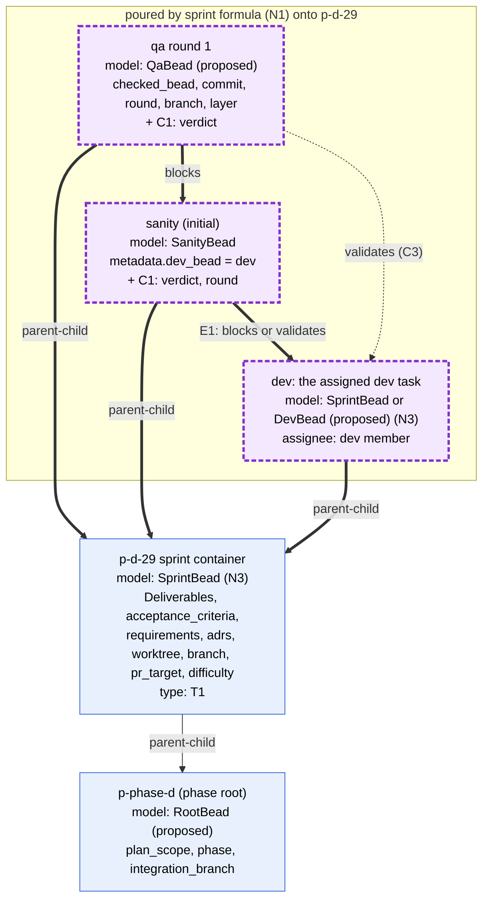
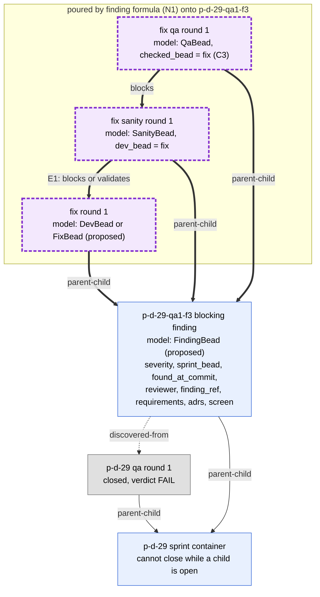
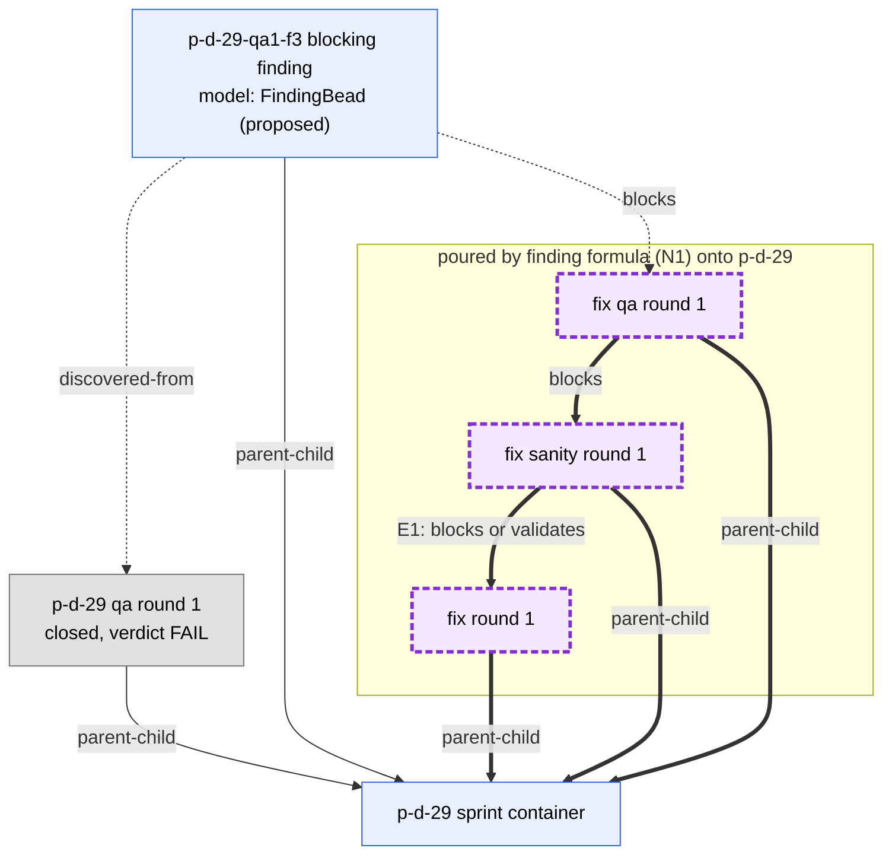
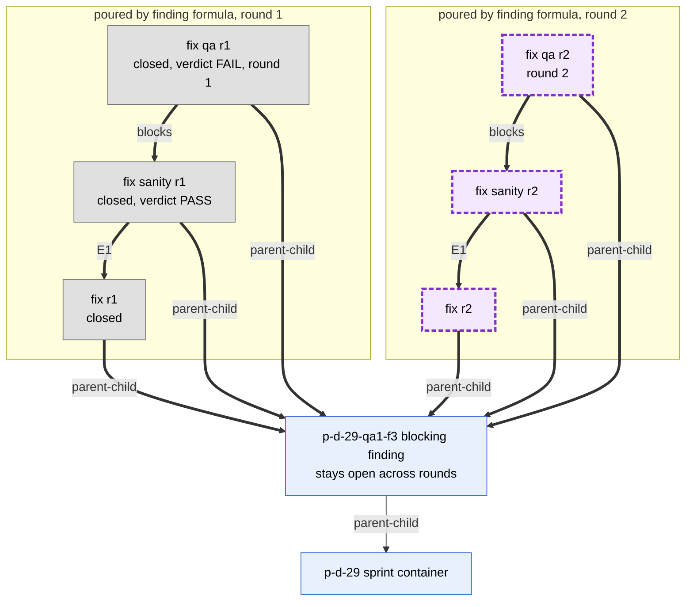

# 4. Sprint level, to-be

In Rand's target model the sprint bead is a container. It cannot close until
every blocking finding is fixed. Its children are:

- the dev task that is actually assigned;
- the sanity task (the brief's "severity-task" is read as sanity);
- the QA task.

When QA fails, its blocking findings become `parent-child` children of the
sprint bead. bd refuses to close a parent while a child is open (verified on
bd 1.3.0), and that is what holds the sprint open. Each blocking finding gets
its own fix, sanity and QA group. Model names marked "proposed" do not exist
in `bead_schema.py` yet.

## 4a. The sprint group, with the schema model of each node

**Legend.** The purple dashed nodes and the thick arrows are poured by the
sprint formula. The plan import creates the sprint container from a template.
`QA blocks sanity` puts QA after sanity. The QA-to-dev pair and the QA-to-sanity
pair are different pairs, so QA can also carry `validates` to the bead it
checks (dotted, because a formula step cannot pour a `validates` edge, N4).
Inside one pair, sanity to dev can carry only one type (E1, drawn in 05).
The existing `SanityBead` validator requires a `blocks` edge to
`metadata.dev_bead`. E1 option B (only `validates`) would therefore need that
model changed, and option C keeps it unchanged.

**Open decisions**

1. E1: the type of the sanity-to-dev edge: A, B or C (05).
2. N3: does `SprintBead` validate the container or the dev child?
3. C1: are verdict and round required metadata on sanity and QA when they
   close, or derived from status and graph?
4. C3: does QA validate the dev bead, at the same PR head sanity checked, or
   the sanity bead? Is "sanity before QA" its own `blocks` edge, as drawn?
5. T1: classify dev, sanity and QA by `issue_type` (custom types) or by schema
   metadata, with no `stage:` labels.
6. Q4: who closes the sprint container, and when? bd does not close a parent
   automatically.

## 4b. QA FAIL: blocking findings under the sprint, and a group per finding

Q1 is open: does each finding's fix, sanity and QA group sit under the finding
or under the sprint? Both layouts are shown.

**Q1 option (a): the group under the finding**

**Q1 option (b): the group under the sprint**

**Legend.** Grey nodes are closed. The finding is filed by QA from
`finding-bead.json.j2`, and its `discovered-from` edge to QA is added outside
the formula (dotted). In (a), the finding is itself a container. bd will not
close it until its group is closed, and the sprint cannot close until the
finding closes. In (b), the finding needs an explicit edge to its group. The
drawing uses `finding blocks fix-qa`, so the finding becomes ready to close
only after its fix QA closes. Without that edge, nothing ties the finding to
its group except metadata.

**Open decisions**

1. Q1: the group under the finding (a) or under the sprint (b)?
2. Q2: do `important` findings count as blocking here? Policy treats
   important as a FAIL. Important and minor findings must not be children of
   the sprint, or they hold it open. Where do they live: under the QA bead,
   under the root, or under a non-gating holder bead?
3. Q3: sanity-FAIL findings are children of the dev bead today (03). Do they
   also go under the sprint container and get a group of their own?
4. C4: severity becomes required `FindingBead` metadata. Under this model,
   `parent-child` to the sprint is a closure gate, not only grouping, because
   the sprint is still open when the finding is filed.
5. C3: does the fix QA check the fix bead or the finding?

## 4c. A second fix round: a new group, never a reopen

**Legend.** Drawn with Q1 option (a). When fix QA round 1 closes with FAIL,
the finding stays open, and the finding formula is poured again with
`round = 2`. No round-1 bead is reopened, so its verdict and evidence stay
intact. The next round number is the highest existing round under the
finding, plus 1. Today the template instead reopens the finding with
`bd reopen` (03). A fix-round QA files no new findings, as today.

**Open decisions**

1. C2: one checker bead per round, never reopened (as drawn), versus the
   current reopen flow.
2. C1: with C2, a round's outcome is read from that round's QA `verdict`, not
   from the finding's status.
3. N2: how round-2 ids are made unique (a round suffix input to the formula).
