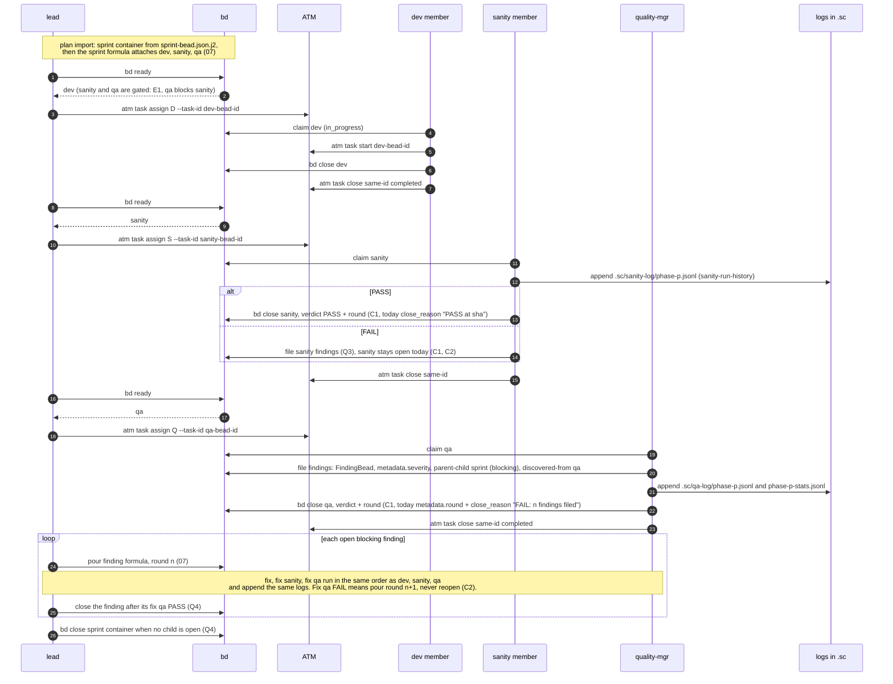
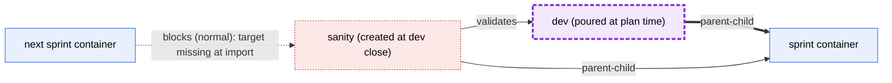
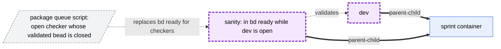
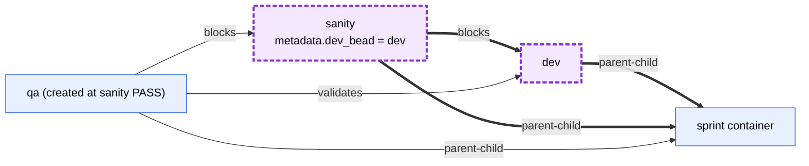

# 5. Lifecycle (sprint level)

## 5a. Ready, claim and close order

**Legend.** Each `atm task` id equals the bead id (06). Where each fact is
written:

| Fact | Bead | Field today | Field to-be |
| --- | --- | --- | --- |
| sanity verdict, pinned sha | sanity bead | `close_reason` "PASS at sha" | `metadata.verdict`, `metadata.commit` (C1) |
| QA verdict | QA bead | `close_reason` "PASS/FAIL: n findings filed" | `metadata.verdict` (C1) |
| round | QA bead | `metadata.round` | `metadata.round` on every checker (C1, C2) |
| severity | finding bead | `metadata.severity` + `severity:` label | `metadata.severity`, required (C4) |

The logs are an OTel contract, and their formats do not change. QA appends
`.sc/qa-log/phase-
.jsonl` and `.sc/qa-log/phase-
-stats.jsonl` when it
closes (`qa-template.xml.j2`). The sanity member appends the sanity ledger
`.sc/sanity-log/phase-
.jsonl` through `sanity-run-history` when the sanity
check closes.

**Open decisions**

1. C1: verdict and round as required metadata written when the checker
   closes (or the ATM close status), or derived from status and graph.
2. C2: if a sanity FAIL closes its bead, the sanity bead's `blocks` edge
   releases the next sprint's "normal" dependency (02). Either a sanity FAIL
   keeps the bead open, as today, or gating reads `verdict` instead of
   status.
3. Q3: where sanity-FAIL findings live, and whether they get a group.
4. Q4: who closes a finding and the sprint container, and when.

## 5b. E1: the edge-per-pair options for dev and sanity inside the sprint

bd 1.3.0 keeps one dependency type per pair, and `validates` does not gate
`bd ready`. So "sanity validates dev" and "sanity is blocked by dev" cannot
both sit on the same pair. Both children's `parent-child` edges go to the
sprint, which is a different pair, so they do not conflict.

**Option A: create the sanity bead when dev closes**

Trade-off: this breaks the plan graph. The next sprint's dev beads have a
`blocks` edge on this sanity bead when the plan is imported, and the bead does
not exist yet.

**Option B: the plan-time sanity bead carries only `validates`**

Trade-off: the edge correlates sanity to dev explicitly, but plain `bd ready`
stops being the queue. The `SanityBead` model, which requires a `blocks`
edge, must change. A formula step cannot pour `validates` (N4).

**Option C: keep the existing schema**

Trade-off: no new edge, no new script, and `bd ready` stays the queue. But
"what does this sanity check" is read from a `blocks` edge plus
`metadata.dev_bead`, not from a dedicated edge type. The sanity bead's
`blocks` edge to its checked bead, together with the required `SanityBead`
`metadata.dev_bead`, handles both gating and correlation. QA is created at
sanity PASS, so it can carry `validates` to the checked bead without a
conflict. If the formula pours QA at plan time instead, the same edges still
hold, because QA-to-dev and QA-to-sanity are different pairs.

**Open decisions**

1. E1: A, B or C. No option is recommended here.
2. T1: custom issue types are supported (`bd config set types.custom`, per
   database), and the withdrawn contract dropped them. Given "no `stage:`
   labels", does classification of dev, sanity and QA use `issue_type`
   (custom or built-in) or schema metadata?
