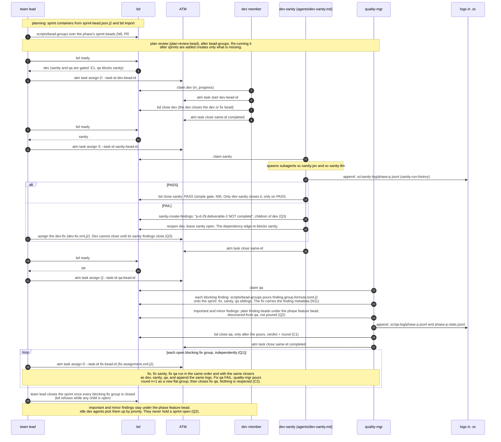
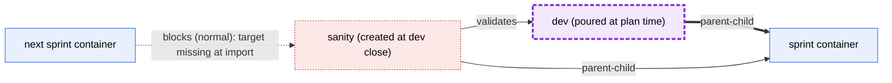
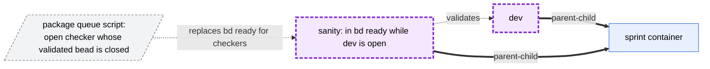
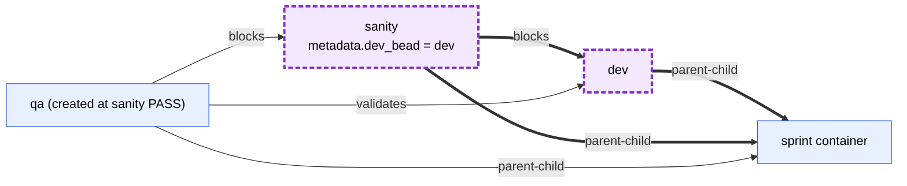

# 5. Lifecycle (sprint level)

## 5a. Ready, claim and close order

**Legend.** Each `atm task` id equals the bead id (06). Where each fact is
written:

| Fact | Bead | Field today | Field to-be |
| --- | --- | --- | --- |
| sanity result | sanity bead (a simple gate) | `close_reason` "PASS at sha"; FAIL leaves child findings "deliverable-N NOT complete" | unchanged; ideally JEV-only later, with JEV output holding the data (N9) |
| QA verdict | QA bead | `close_reason` "PASS/FAIL: n findings filed" | `metadata.verdict` (C1) |
| round | QA bead | `metadata.round` | `metadata.round` on every checker (C1, C2) |
| severity | finding bead | `metadata.severity` + `severity:` label | `metadata.severity` on the fix bead and on finding beads (C4) |

Who closes what (decided, 2026-10-03): the dev closes the dev or fix bead.
dev-sanity closes the sanity bead on PASS only; on FAIL it reopens the dev or
fix bead and leaves sanity open, and the dependency edge re-blocks sanity.
quality-mgr closes the qa bead, and only after it has poured the blocking fix
groups and created the important and minor finding beads. The team lead closes
the sprint once every blocking fix group is closed.

The logs are an OTel contract, and their formats do not change. QA appends
`.sc/qa-log/phase-
.jsonl` and `.sc/qa-log/phase-
-stats.jsonl` when it
closes (`qa-template.xml.j2`). dev-sanity appends the sanity ledger
`.sc/sanity-log/phase-
.jsonl` through `sanity-run-history` when the sanity
check closes.

**Open decisions**

1. C1: verdict and round as required metadata written when the checker
   closes (or the ATM close status), or derived from status and graph.
2. C2: one QA bead per round, never reopened.

Decided (Rand): Q1, one independent group per blocking finding; Q2,
important and minor findings sit under a phase feature bead; Q3, sanity
findings hold the dev bead open and so hold the sprint open; Q4, the team
lead closes the sprint; N8, the post-pour step runs after planning and before
plan review; N9, sanity is a simple gate that keeps the bead open on FAIL, as
today. Decided 2026-10-03: the flat fix model (each group is `fix ← sanity ←
qa` siblings under the sprint, no finding container), the closers above, and
N11 (quality-mgr pours the finding groups, before it closes qa). N10
(quality-mgr closes a blocking finding) is superseded: there is no separate
blocking-finding bead to close.

dev-sanity is one named teammate with one agent prompt,
`plugins/atm-bd-orchestration/agents/dev-sanity.md`, which spawns the
subagents `sc-sanity-jev` and `sc-sanity-llm`.

## 5b. E1: the edge-per-pair options for dev and sanity inside the sprint

bd 1.3.0 keeps one dependency type per pair, and `validates` does not gate
`bd ready`. So "sanity validates dev" and "sanity is blocked by dev" cannot
both sit on the same pair. Both children's `parent-child` edges go to the
sprint, which is a different pair, so they do not conflict.

**Option A: create the sanity bead when dev closes**

Trade-off: this breaks the plan graph. The next sprint's dev beads have a
`blocks` edge on this sanity bead when the plan is imported, and the bead does
not exist yet.

**Option B: the plan-time sanity bead carries only `validates`**

Trade-off: the edge correlates sanity to dev explicitly, but plain `bd ready`
stops being the queue. The option is feasible with the post-pour step:
sc-compose pours the sanity bead, and the post-pour step adds its `validates`
edge (dotted). The `SanityBead` model, which requires a `blocks` edge, must
change. A `validates` edge also does not re-block sanity when dev-sanity
reopens the dev bead on FAIL, which the 2026-10-03 ruling relies on.

**Option C: keep the existing schema**

Trade-off: no new edge, no new script, and `bd ready` stays the queue. But
"what does this sanity check" is read from a `blocks` edge plus
`metadata.dev_bead`, not from a dedicated edge type. The sanity bead's
`blocks` edge to its checked bead, together with the required `SanityBead`
`metadata.dev_bead`, handles both gating and correlation. QA is created at
sanity PASS, so it can carry `validates` to the checked bead without a
conflict. If the formula pours QA at plan time instead, the same edges still
hold, because QA-to-dev and QA-to-sanity are different pairs.

**Open decisions**

1. E1: A, B or C. No option is recommended here.
2. T1: custom issue types are supported (`bd config set types.custom`, per
   database), and the withdrawn contract dropped them. Given "no `stage:`
   labels", does classification of dev, sanity and QA use `issue_type`
   (custom or built-in) or schema metadata?
