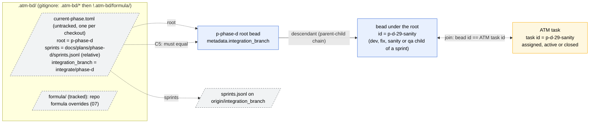
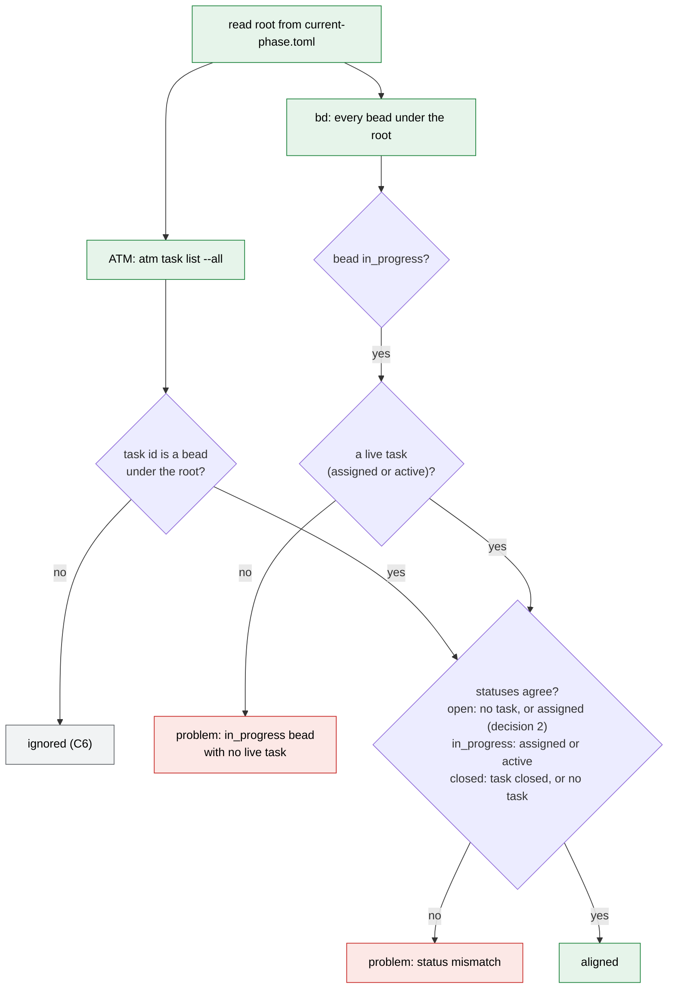

# 6. Correlation: beads, ATM tasks, and the current phase

## 6a. Resolving the phase and joining beads to ATM tasks

**Legend.** `.atm-bd/current-phase.toml` is per checkout and untracked, so every
worktree resolves its own phase root without passing `--root`. It holds three
keys: the root bead id, the path of `sprints.jsonl` relative to the
repository, and the integration branch. Beads and ATM tasks are joined by
identical ids: work is assigned with `atm task assign <member> --task-id
<bead id>`. The arrow from the root to a bead is the parent-child chain
followed downward, not a single edge.

Under the flat fix model (decided 2026-10-03) every poured bead (dev, sanity,
qa, and each blocking finding's fix, sanity, qa) is a direct child of a sprint
container, so for those the chain is root, sprint, child. Each is one ATM
task, held by the member that closes it:

| Bead | ATM task held by | Template |
| --- | --- | --- |
| dev | dev member | `dev-template.xml.j2` (`dev-fix.xml.j2` after a sanity FAIL) |
| fix (one per blocking finding, carries the finding's metadata) | dev member | `fix-assignment.xml.j2` |
| sanity (sprint or fix group) | dev-sanity (`agents/dev-sanity.md`, spawns `sc-sanity-jev` and `sc-sanity-llm`) | `dev-sanity-template.xml.j2` |
| qa (sprint or fix group) | quality-mgr | `qa-template.xml.j2` |
| important or minor finding (under the phase feature bead) | an idle dev, by priority | not decided |

The sprint container is closed by the team lead once every blocking fix group
is closed.

**Open decisions**

1. C5: either the toml's `integration_branch` is authoritative, or root
   `metadata.integration_branch` is authoritative and the toml value is
   validated against it.

## 6b. The ATM-to-bead alignment check

**Legend.** Green steps are the check, red boxes are reported problems, and
grey is out of scope. The check reports problems and never repairs either
side, the same way `validate-plan` works today. The status-agreement table in
the diamond is a first draft for review.

**Open decisions**

1. C6: the scope. Only ATM tasks whose id is a bead under the root are
   checked. An `in_progress` bead must have a live task. Statuses must agree.
   ATM tasks with no bead are ignored.
2. Is the status-agreement table right? As drawn, an `open` bead with an
   assigned task that has not started counts as agreement, because that is
   the normal state before a claim.

## Future (note, not a decision)

The atm-bd app will run a cron task that analyzes bead and ATM state and sends
the lead any assignments it missed. Sanity and quality-mgr beads will then be
assigned automatically with `atm task assign --template --vars`, keeping the
bead id equal to the ATM task id.
