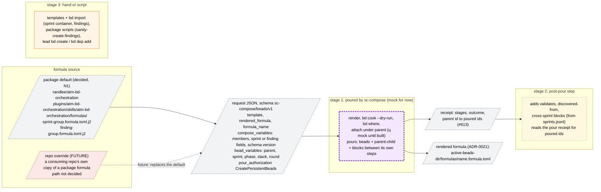
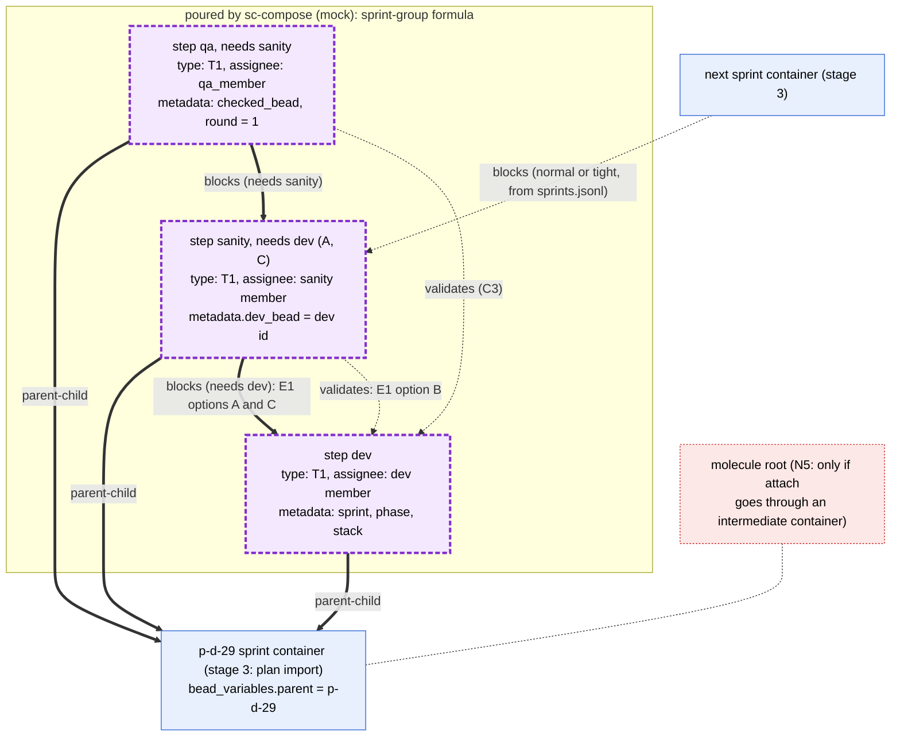
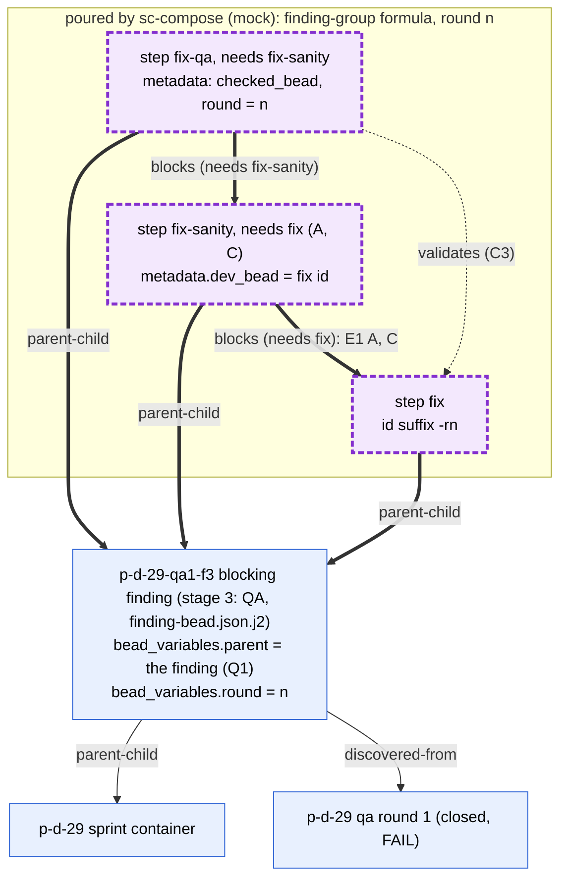
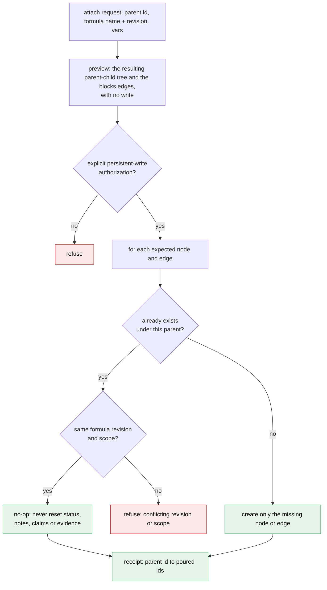

# 7. The sc-compose beads formula (detail)

Sources:

- randlee/sc-compose #551: proposal to author bd formulas with sc-compose.
- randlee/sc-compose #613: attaching sprint workflows to existing parents,
  with resume-safe expansion.
- sc-compose ADR-0021 (accepted, `docs/adrs/0021-beads-formula-composition-integration.md`
  at sc-compose 58f4d00): the `sc-compose/beads/v1` request contract.
- `sc-compose bead --help` (1.6.1) and `bd formula schema step` (bd 1.3.0).

Neither formula exists yet. The attach operation #613 asks for does not exist
in sc-compose 1.6.1, which offers `render`, `validate`, `preview-pour` and
`pour`. Until it exists, a mock script stands in for the sc-compose pour. A
separate agent is writing that mock now.

Decided (Rand): formulas live in the package for now (N1). Pouring has three
stages (N4):

1. sc-compose pours the formula (the mock for now);
2. a post-pour step adds the edges a formula cannot express: `validates`,
   `discovered-from` and cross-sprint `blocks`;
3. everything else is created by hand or by a script.

## 7a. The three stages, inputs, and where the formula is defined

**Legend.** Stage 1 (purple) is the pour. Its edges are drawn as thick arrows
in every diagram. Stage 2 (amber) is the post-pour step. Its edges are drawn
as dotted arrows. Stage 3 (orange) is everything made by hand or by a script,
drawn as solid arrows. ADR-0021 fixes the rendered output path,
`<active-beads-dir>/formulas/<formula-name>.formula.toml`; the package
directory holds the source the request renders from. #551 notes that bd
formulas have no foreach and no list variables. Neither group formula needs
one: each pours a fixed three steps.

What a formula step can express (`bd formula schema step`, bd 1.3.0):

- `title`, `type` (built-in, or a custom type already in `types.custom`; any
  other type is flattened to `task` with a warning), `labels`, `metadata`,
  `assignee`, `priority`;
- `needs` or `depends_on`, which take only sibling step ids and pour `blocks`
  edges.

So the pour itself cannot create `validates`, `discovered-from`, or an edge to
a bead outside the formula (#613: "A formula dependency on an external sprint
fails as an unknown step"). Those are stage 2.

**Open decisions**

1. N7: where a future repo override lives, and how the package default is chosen
   when no override exists.
2. N8: whether the post-pour step is a package script or part of the mock and,
   later, of the sc-compose attach operation.

## 7b. Sprint formula: the exact beads and edges, by stage

**Legend.** Thick arrows are stage 1, dotted arrows are stage 2, solid nodes
are stage 3. Exactly one of the two sanity-to-dev edges exists, depending on
E1. Under option B the formula's sanity step has no `needs dev`, and the
post-pour step adds `validates`. The "tight" variant points the cross-sprint
`blocks` at the sprint container instead of the sanity bead (02). Today
`bd mol pour` creates a new parentless molecule with generated ids, and a
sprint variable does not attach it (#613 gap 1). So the stage 1 `parent-child`
edges to the existing sprint need the attach operation, and the mock provides
it until then.

**Open decisions**

1. E1: A, B or C (05). All three are feasible with the post-pour step.
2. N2: the ids of the poured beads must be deterministic and must match the
   sanity id that `sprints.jsonl` names at plan time. Native
   `bd mol bond --ref` gives `<parent>.<ref>.<step>`, for example
   `p-d-29.group.sanity`; plain `pour` gives generated ids.
3. N5: #613 asks sc-compose to document whether children attach directly
   under the sprint or under an intermediate workflow container (the molecule
   root).
4. Metadata values in a step (`metadata.dev_bead = dev id`) assume variable
   substitution inside `metadata`. bd documents substitution for title,
   description, notes and assignee only. Unverified; if it is unsupported,
   the post-pour step writes them.

## 7c. Finding formula: the exact beads and edges for one blocking finding

**Legend.** One pour per blocking finding, independent of every other finding
(Q1, decided). The finding itself is stage 3: QA files it from
`finding-bead.json.j2`, and that import creates its `parent-child` and
`discovered-from` edges. The post-pour step adds `discovered-from` only when a
bead is not created by that template. A second round is the same formula
poured again with `round = n+1` (04c). Important and minor findings get no
pour; they wait under the phase feature bead (Q2, 02b).

**Open decisions**

1. N2: round-unique ids (`-r1`, `-r2`) as a formula input.
2. C3: whether the fix QA validates the fix bead or the finding.

## 7d. Resume-safe attach onto an existing parent (#613)

**Legend.** These are the behaviors #613 requires. Running the same request
again changes nothing, and a run that stopped partway resumes by creating only
what is missing. #613 observed that native `bd mol bond --type parallel --ref`
attaches deterministically, but repeating it reopened a closed child and
cleared its notes on bd 1.3.0. So bond cannot be used blindly for resume. That
behavior is an upstream bd concern, and sc-compose must not expose it as a
safe retry. The mock that stands in for sc-compose must keep the same rules,
and the post-pour step (stage 2) must be idempotent in the same way: it adds
only edges that are missing.

**Open decisions**

1. N5: direct attach, or attach under an intermediate workflow container.
2. N2: stable identity. Resume matching needs ids, or a recorded formula
   revision and scope, that a second run can find again.
