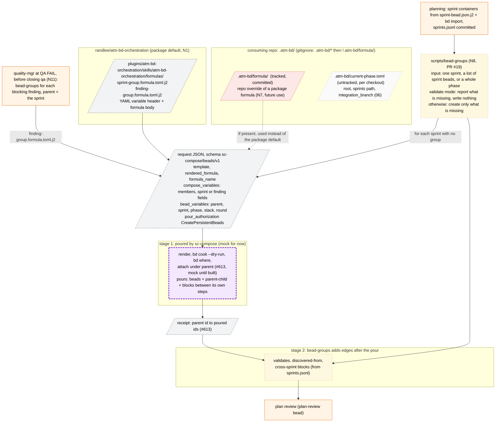
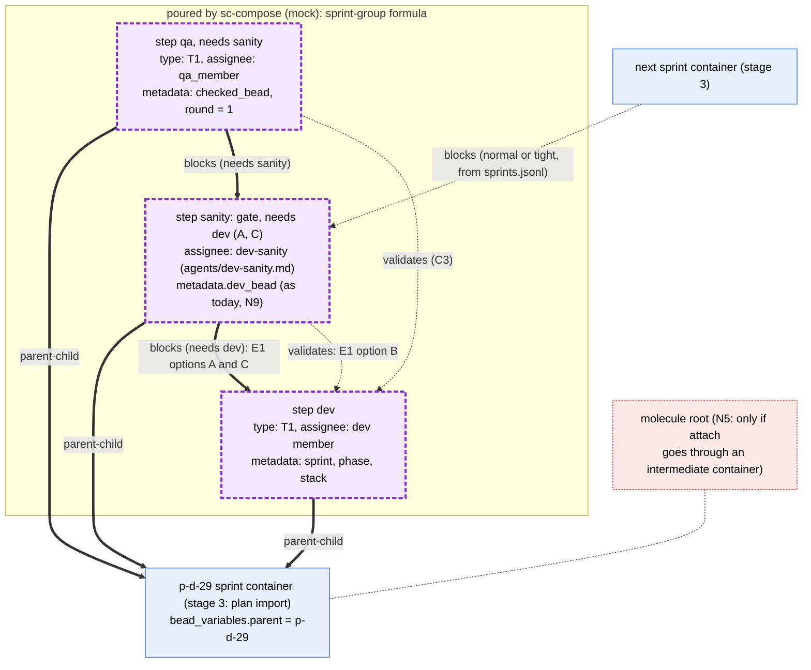
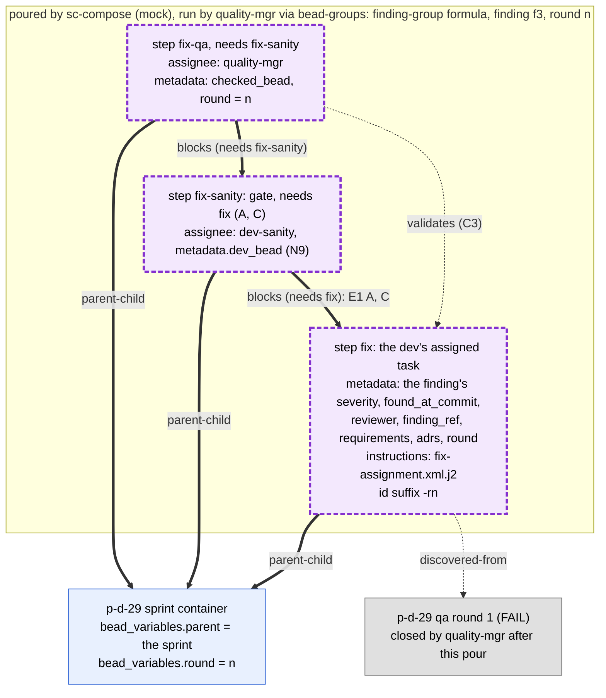
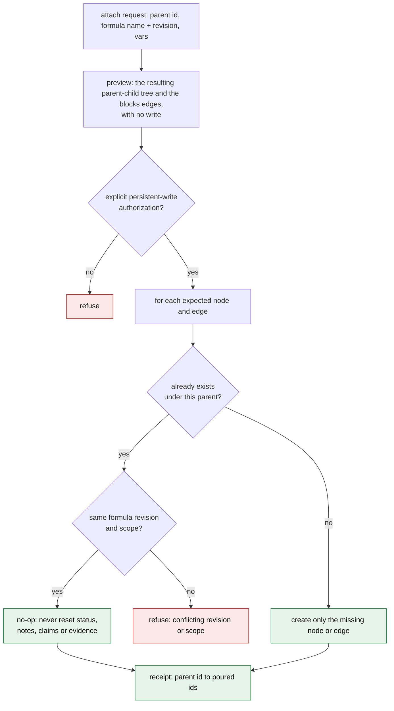

# 7. The sc-compose beads formula (detail)

Sources:

- randlee/sc-compose #551: proposal to author bd formulas with sc-compose.
- randlee/sc-compose #613: attaching sprint workflows to existing parents,
  with resume-safe expansion.
- sc-compose ADR-0021 (accepted, `docs/adrs/0021-beads-formula-composition-integration.md`
  at sc-compose 58f4d00): the `sc-compose/beads/v1` request contract.
- `sc-compose bead --help` (1.6.1) and `bd formula schema step` (bd 1.3.0).

Both formulas, the mock and the post-pour step are implemented in PR #19
(open): `scripts/sc-compose-pour-mock` stands in for the sc-compose pour, and
`scripts/bead-groups` (under
`plugins/atm-bd-orchestration/skills/atm-bd-orchestration/`) runs the pour and
then adds the edges a formula cannot express, over the same targets. The
attach operation #613 asks for does not exist in sc-compose 1.6.1, which
offers `render`, `validate`, `preview-pour` and `pour`.

Decided (Rand):

- **N1:** formulas live in the package for now.
- **N7:** a repo may override a package formula in `.atm-bd/formula/`, which
  is committed to git.
- **N4:** pouring has three stages:
  1. sc-compose pours the formula (the mock for now);
  2. a post-pour script adds the edges a formula cannot express: `validates`,
     `discovered-from` and cross-sprint `blocks`;
  3. everything else is created by hand or by a script.
- **N8:** the post-pour script runs after planning and before plan review. It
  takes one sprint, a list of sprint beads, or every sprint in a phase. It has
  a validate mode, and it fills in only what is missing, so it is safe to
  re-run after sprints are added. Planning itself stays out of it. PR #19
  implements it as `scripts/bead-groups`.
- **Q1:** one independent group per blocking finding. The sc-compose beads
  formula will be extended for "advanced pouring", building on the formula's
  existing YAML variable header (the front matter that declares
  `required_variables` and defaults, as in the package `.j2` templates). The
  extension lands there, in sc-compose, not in the package.
- **Flat fix model (2026-10-03, supersedes "the group attaches under the
  finding"):** `finding-group.formula.toml.j2` attaches to the sprint as
  parent. Its three steps, `fix ← sanity ← qa`, are siblings of the sprint's
  own `dev ← sanity ← qa`. There is no finding container. The fix bead is the
  dev's assigned task and carries the finding's metadata; its instructions
  are in `fix-assignment.xml.j2`.
- **N11 (2026-10-03):** quality-mgr runs the finding-group pour and its
  post-pour edges with `scripts/bead-groups`, before it closes the QA bead.

## 7a. The three stages, inputs, and where the formula is defined

**Legend.** Stage 1 (purple) is the pour. Its edges are drawn as thick arrows
in every diagram. Stage 2 (amber) is the post-pour script. Its edges are drawn
as dotted arrows. Stage 3 (orange) is everything made by hand or by a script,
drawn as solid arrows. `.atm-bd/` holds both the tracked `formula/` override
directory and the untracked per-checkout `current-phase.toml`, so the
repository's `.gitignore` has `.atm-bd/*` followed by `!.atm-bd/formula/`.
ADR-0021 fixes the rendered output path,
`<active-beads-dir>/formulas/<formula-name>.formula.toml`; the package
directory, or the override, holds the source the request renders from. #551
notes that bd formulas have no foreach and no list variables. Neither group
formula needs one: each pours a fixed three steps.

What a formula step can express (`bd formula schema step`, bd 1.3.0):

- `title`, `type` (built-in, or a custom type already in `types.custom`; any
  other type is flattened to `task` with a warning), `labels`, `metadata`,
  `assignee`, `priority`;
- `needs` or `depends_on`, which take only sibling step ids and pour `blocks`
  edges.

So the pour itself cannot create `validates`, `discovered-from`, or an edge to
a bead outside the formula (#613: "A formula dependency on an external sprint
fails as an unknown step"). Those are stage 2.

N11 is decided (2026-10-03): quality-mgr runs `scripts/bead-groups` for each
blocking finding, which pours the finding-group formula onto the sprint and
adds its post-pour edges, before it closes the QA bead.

## 7b. Sprint formula: the exact beads and edges, by stage

**Legend.** Thick arrows are stage 1, dotted arrows are stage 2, solid nodes
are stage 3. Exactly one of the two sanity-to-dev edges exists, depending on
E1. Under option B the formula's sanity step has no `needs dev`, and the
post-pour script adds `validates`. The "tight" variant points the cross-sprint
`blocks` at the sprint container instead of the sanity bead (02). Today
`bd mol pour` creates a new parentless molecule with generated ids, and a
sprint variable does not attach it (#613 gap 1). So the stage 1 `parent-child`
edges to the existing sprint need the attach operation, and the mock provides
it until then.

**Open decisions**

1. E1: A, B or C (05). All three are feasible with the post-pour script.
2. N2: the ids of the poured beads must be deterministic and must match the
   sanity id that `sprints.jsonl` names at plan time. Native
   `bd mol bond --ref` gives `<parent>.<ref>.<step>`, for example
   `p-d-29.group.sanity`; plain `pour` gives generated ids.
3. N5: #613 asks sc-compose to document whether children attach directly
   under the sprint or under an intermediate workflow container (the molecule
   root).
4. Metadata values in a step (`metadata.dev_bead = dev id`) assume variable
   substitution inside `metadata`. bd documents substitution for title,
   description, notes and assignee only. Unverified; if it is unsupported,
   the post-pour script writes them.

## 7c. Finding formula: the exact beads and edges for one blocking finding

**Legend.** One pour per blocking finding, independent of every other finding
(Q1). The formula attaches to the sprint as parent, so the three steps are
siblings of the sprint's own dev, sanity and qa (flat fix model, decided
2026-10-03). There is no separate blocking-finding bead: the fix step carries
the finding's metadata, and the fix's `discovered-from` edge to the QA bead
that found it is a post-pour edge (dotted), since a formula cannot express it.
A second round is the same formula poured again onto the sprint with
`round = n+1` (04c). The dev closes the fix, dev-sanity closes the fix sanity
on PASS only, and quality-mgr closes the fix qa. Important and minor findings
get no pour; they are plain finding beads under the phase feature bead (Q2,
02b). PR #19 (merged, 0.8.0) takes one QA round's blocking findings with
`--findings FILE` and attaches each group to the sprint. This flat
one-finding-one-fix shape is new structure relative to phase-d (03, 3c), and
migrating the phase-d data is post-phase-d work.

**Open decisions**

1. N2: round-unique ids (`-r1`, `-r2`) as a formula input.
2. C3: whether the fix QA validates the fix bead (as drawn) or the fix sanity.

## 7d. Resume-safe attach onto an existing parent (#613)

**Legend.** These are the behaviors #613 requires. Running the same request
again changes nothing, and a run that stopped partway resumes by creating only
what is missing. #613 observed that native `bd mol bond --type parallel --ref`
attaches deterministically, but repeating it reopened a closed child and
cleared its notes on bd 1.3.0. So bond cannot be used blindly for resume. That
behavior is an upstream bd concern, and sc-compose must not expose it as a
safe retry. The mock that stands in for sc-compose must keep the same rules,
and the post-pour script (stage 2) must be idempotent in the same way: it adds
only edges that are missing.

**Open decisions**

1. N5: direct attach, or attach under an intermediate workflow container.
2. N2: stable identity. Resume matching needs ids, or a recorded formula
   revision and scope, that a second run can find again.
