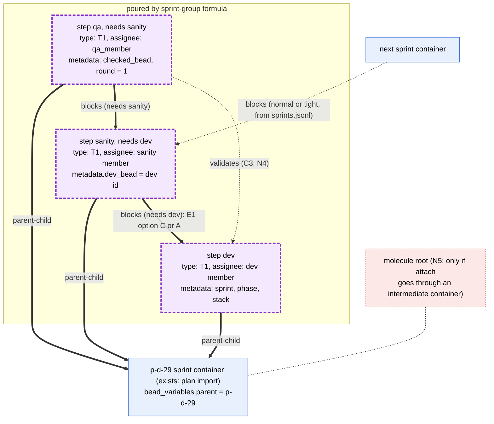
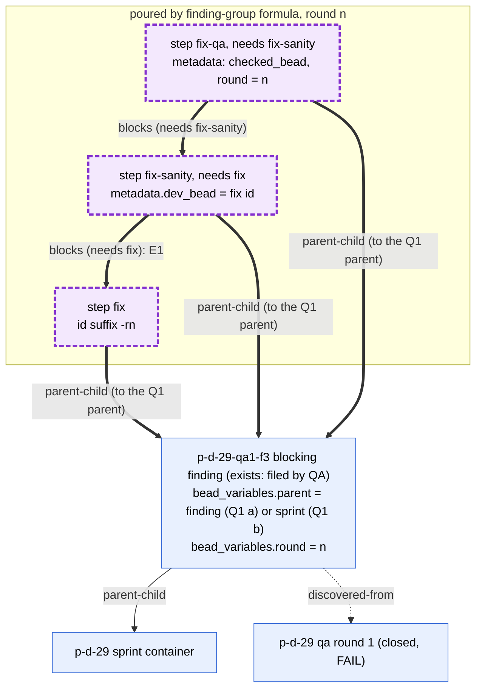
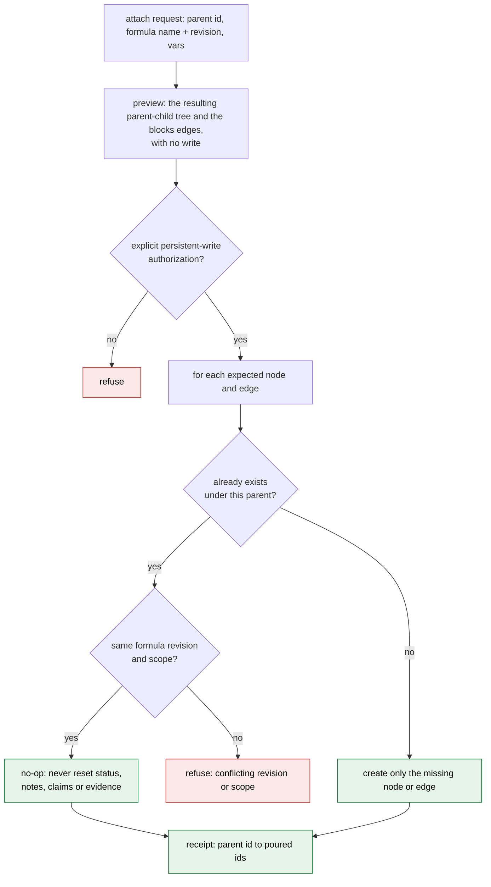

# 7. The sc-compose beads formula (detail)

Sources:

- randlee/sc-compose #551: proposal to author bd formulas with sc-compose.
- randlee/sc-compose #613: attaching sprint workflows to existing parents,
  with resume-safe expansion.
- sc-compose ADR-0021 (accepted, `docs/adrs/0021-beads-formula-composition-integration.md`
  at sc-compose 58f4d00): the `sc-compose/beads/v1` request contract.
- `sc-compose bead --help` (1.6.1) and `bd formula schema step` (bd 1.3.0).

Neither formula exists yet. The attach operation #613 asks for does not exist
in sc-compose 1.6.1, which offers `render`, `validate`, `preview-pour` and
`pour`.

## 7a. Inputs and where the formula is defined

```mermaid
flowchart LR
  classDef file fill:#f1f3f4,stroke:#5f6368,stroke-dasharray:4 3,color:#000
  classDef open fill:#fce8e6,stroke:#c5221f,stroke-dasharray:2 2,color:#000
  classDef tool fill:#e6f4ea,stroke:#188038,color:#000
  classDef fixed fill:#e8f0fe,stroke:#3367d6,color:#000

  subgraph SRC["formula source: N1, one of"]
    S1[/"(a) randlee/atm-bd-orchestration<br/>plugins/atm-bd-orchestration/skills/atm-bd-orchestration/formulas/<br/>sprint-group.formula.toml.j2, finding-group.formula.toml.j2<br/>installed into the consuming repo by install.py"/]:::open
    S2[/"(b) randlee/sc-compose<br/>shared fragment library (#551, concept 3)<br/>no path defined yet"/]:::open
    S3[/"(c) consuming repo, e.g. randlee/sc-observability<br/>a source template it owns,<br/>or a hand-written formula in .beads/formulas/"/]:::open
  end

  REQ[/"request JSON, schema sc-compose/beads/v1<br/>operation: preview-pour, pour (attach: #613, not built)<br/>working_directory, template, rendered_formula<br/>compose_variables: members, sprint or finding fields, schema version<br/>bead_variables (bd --var): parent, sprint, phase, stack, round<br/>formula_name, pour_authorization CreatePersistentBeads"/]:::file
  SC["sc-compose bead<br/>render, then bd cook --dry-run,<br/>then bd where --json, then bd mol pour"]:::tool
  OUT[/"rendered formula, fixed by ADR-0021:<br/>active-beads-dir/formulas/name.formula.toml<br/>(the registry bd where resolves)"/]:::fixed
  BD["bd (authoritative for formula<br/>parsing, state, bead creation)"]:::tool
  RCPT[/"receipt: stages, argv, outcome<br/>#613 adds: map of parent to poured ids"/]:::file

  SRC --> REQ
  REQ --> SC
  SC --> OUT
  OUT --> BD
  BD --> RCPT
```

**Legend.** Red dashed boxes are candidate locations (N1). Neither #551 nor
#613 settles where the formula source lives. ADR-0021 fixes only the rendered
output path, `<active-beads-dir>/formulas/<formula-name>.formula.toml`; a
`.formula.json` is accepted, but the same name in both formats is refused.
#551 notes that bd formulas have no foreach and no list variables. Neither
group formula needs one: each pours a fixed three steps.

What a formula step can express (`bd formula schema step`, bd 1.3.0):

- `title`, `type` (built-in, or a custom type already in `types.custom`; any
  other type is flattened to `task` with a warning), `labels`, `metadata`,
  `assignee`, `priority`;
- `needs` or `depends_on`, which take only sibling step ids and pour `blocks`
  edges.

So a formula cannot pour `validates`, `discovered-from`, or an edge to a bead
outside itself (#613: "A formula dependency on an external sprint fails as an
unknown step").

**Open decisions**

1. N1: where the source lives: (a) the package, (b) sc-compose, or (c) the
   consuming repo. The candidate paths are drawn above.
2. N4: who adds the edges a formula cannot express: the sc-compose attach
   operation (#613) or a package script after the pour.

## 7b. What the sprint formula pours, onto an existing sprint container

**Legend.** Thick arrows are poured. Dotted arrows are added outside the
formula (N4). Today `bd mol pour` creates a new parentless molecule with
generated ids, and passing a sprint variable does not attach it (#613 gap 1).
So the `parent-child` edges to the existing sprint need the #613 attach
operation. Under E1 option B the `needs dev` edge is not used, and
`validates` has to be added outside the formula.

**Open decisions**

1. E1: `needs dev` pours `blocks`, which fits options A and C. Option B needs
   `validates`, which the formula cannot pour.
2. N2: the ids of the poured beads must be deterministic and must match the
   sanity id that `sprints.jsonl` names at plan time. Native
   `bd mol bond --ref` gives `<parent>.<ref>.<step>`, for example
   `p-d-29.group.sanity`; plain `pour` gives generated ids.
3. N5: #613 asks sc-compose to document whether children attach directly
   under the sprint or under an intermediate workflow container (the molecule
   root). A container would add a level between the sprint and its group.
4. Metadata values in a step (`metadata.dev_bead = dev id`) assume variable
   substitution inside `metadata`. bd documents substitution for title,
   description, notes and assignee only. Unverified.

## 7c. What the finding formula pours, for one blocking finding

**Legend.** Drawn with Q1 option (a), the group under the finding. Under
option (b) the three `parent-child` edges go to the sprint container, and the
edge that ties the finding to its group is added outside the formula (04b).
A second round is the same formula poured again with `round = n+1` (04c).

**Open decisions**

1. Q1: the parent of the group: the finding or the sprint.
2. Q2: whether `important` findings also get this formula.
3. N2: round-unique ids (`-r1`, `-r2`) as a formula input.

## 7d. Resume-safe attach onto an existing parent (#613)

**Legend.** These are the behaviors #613 requires. Running the same request
again changes nothing, and a run that stopped partway resumes by creating only
what is missing. #613 observed that native `bd mol bond --type parallel --ref`
attaches deterministically, but repeating it reopened a closed child and
cleared its notes on bd 1.3.0. So bond cannot be used blindly for resume. That
behavior is an upstream bd concern, and sc-compose must not expose it as a
safe retry.

**Open decisions**

1. N5: direct attach, or attach under an intermediate workflow container.
2. N2: stable identity. Resume matching needs ids, or a recorded formula
   revision and scope, that a second run can find again.
