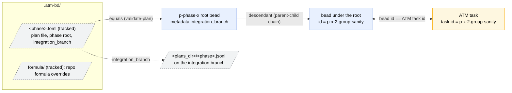

# Correlation: beads, ATM tasks and the current phase

Tracked `.atm-bd/<phase>.toml` names the plan file, the phase root and the
integration branch; `validate-plan` checks that the integration branch equals
the root's `metadata.integration_branch`.
Work is assigned with `atm task assign <member> --task-id <bead id>`; the lead
picks the agent at dispatch.

| Bead | ATM task held by | Template |
| --- | --- | --- |
| dev | a dev, by `difficulty` | `dev-template.xml.j2` (`dev-fix.xml.j2` after a sanity FAIL) |
| fix | a dev, by `difficulty` | `fix-assignment.xml.j2` |
| sanity | dev-sanity | `dev-sanity-template.xml.j2` |
| qa | quality-mgr | `qa-template.xml.j2` |
| important or minor finding | an idle dev, by priority | `fix-assignment.xml.j2` |
| sprint container | none; the team lead closes it | none |
