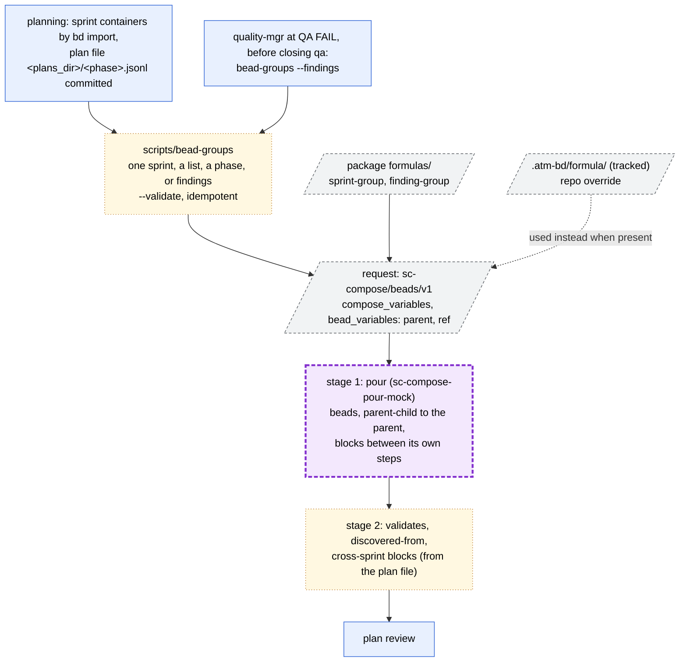
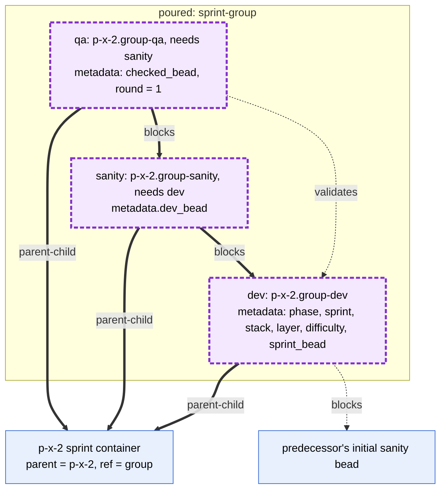
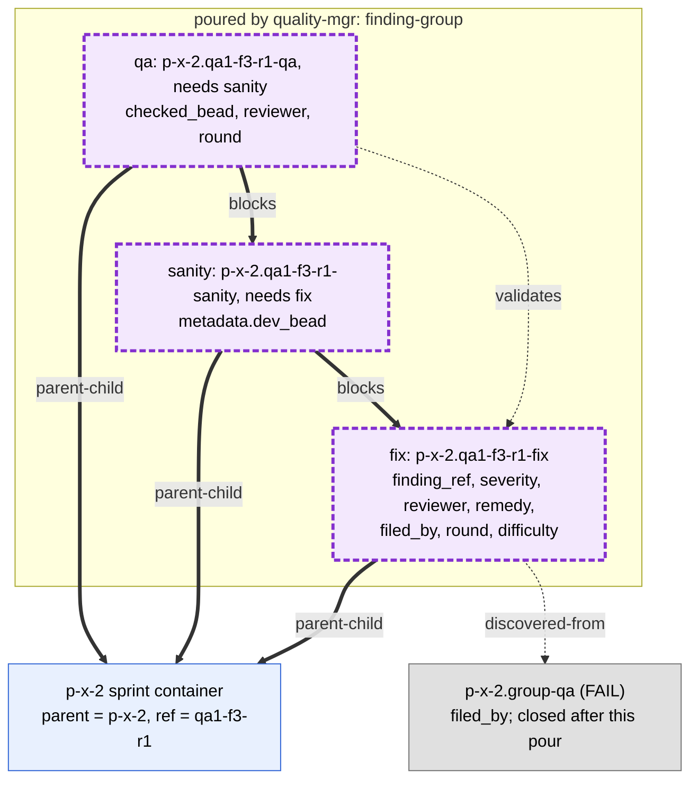
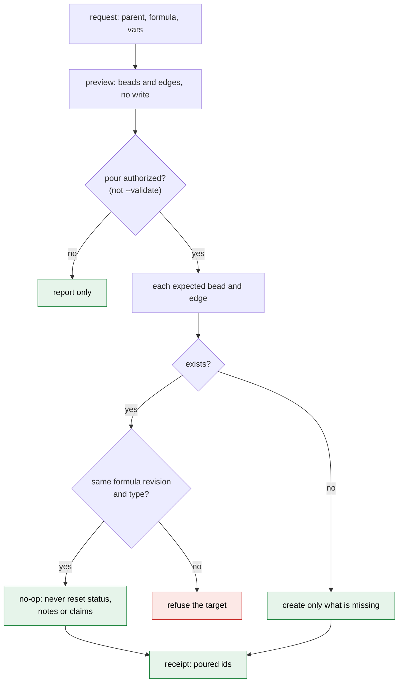

# Formulas and pouring

Formulas live in the package at
`plugins/atm-bd-orchestration/skills/atm-bd-orchestration/formulas/`, two files
each: `<name>.formula.toml.j2` (the sc-compose source) and
`<name>.relations.json` (attach ref and post-pour edges). A file of the same
name in the repository's `.atm-bd/formula/` (tracked) overrides the package
one.

Pouring has three stages:

1. sc-compose pours the formula, schema `sc-compose/beads/v1`. Until
   sc-compose has an attach pour, `scripts/sc-compose-pour-mock` stands in.
2. A post-pour step adds the edges a formula cannot express: `validates`,
   `discovered-from` and cross-sprint `blocks`.
3. Everything else is created from templates or by package scripts.

`scripts/bead-groups` runs stages 1 and 2. Targets: one sprint (`--sprint`), a
list (`--sprint a,b`), a whole phase (`--phase`), or one QA round's blocking
findings (`--findings FILE`). `--validate` changes no bead and reports what is
missing or wrong. It creates only what is missing, so it is safe to re-run
after sprints are added. Requests and receipts go to `.atm-bd/pour/`
(ignored).

## Stages and inputs

A formula step can set `title`, `type`, `labels`, `metadata`, `priority` and
`needs` (sibling steps only, poured as `blocks`). So `validates`,
`discovered-from` and edges to beads outside the formula are stage 2. Poured
ids are `<parent>.<ref>-<step>`.

## Sprint formula

## Finding formula: one blocking finding

Only `severity = blocking` is poured; `bead-groups` refuses others. It also
refuses to pour once the `filed_by` qa bead is closed, so quality-mgr pours
first and closes qa after. A second round is the same formula with
`round = n+1`.

## Idempotent attach

A run that stopped partway resumes by creating only what is missing. An edge
that exists with another type (bd keeps one type per pair) or a bead at a
poured id from another formula revision refuses that target before its edges
are written.
