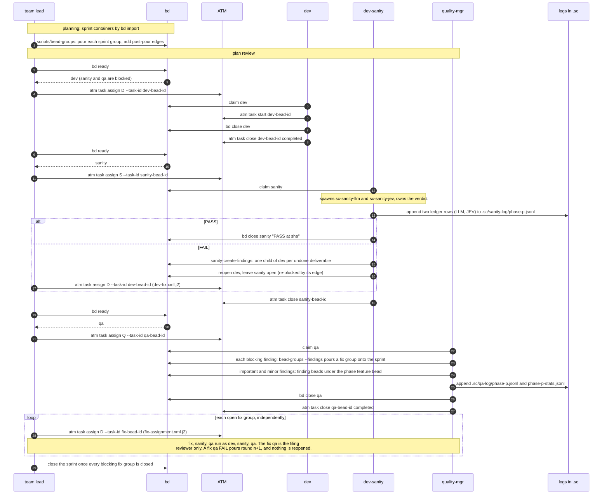

# Lifecycle (sprint level)

Each ATM task id equals its bead id (correlation.md).

| Fact | Where it is written |
| --- | --- |
| sanity result | sanity bead `close_reason` "PASS at sha"; FAIL leaves child findings "deliverable-N NOT complete" |
| QA verdict | qa bead `close_reason` |
| round | `metadata.round` on qa and fix beads |
| severity | `metadata.severity` on fix and finding beads |

dev-sanity appends the sanity ledger `.sc/sanity-log/phase-
.jsonl` with
`sanity-run-history`: two rows per run, one for LLM and one for JEV, sharing a
`run_id` and the final verdict. quality-mgr appends
`.sc/qa-log/phase-
.jsonl` and `.sc/qa-log/phase-
-stats.jsonl` when it
closes qa.
