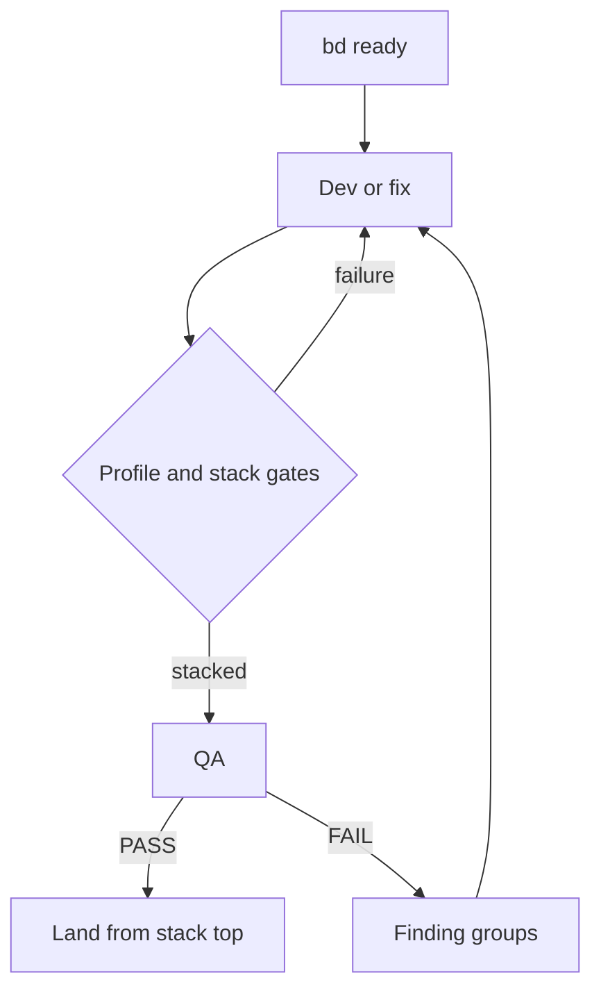

# Lite lifecycle

```mermaid
flowchart TD
  R[bd ready] --> D[Dev or fix]
  D --> G{Profile and stack gates}
  G -->|failure| D
  G -->|stacked| Q[QA]
  Q -->|PASS| L[Land from stack top]
  Q -->|FAIL| F[Finding groups]
  F --> D
```
