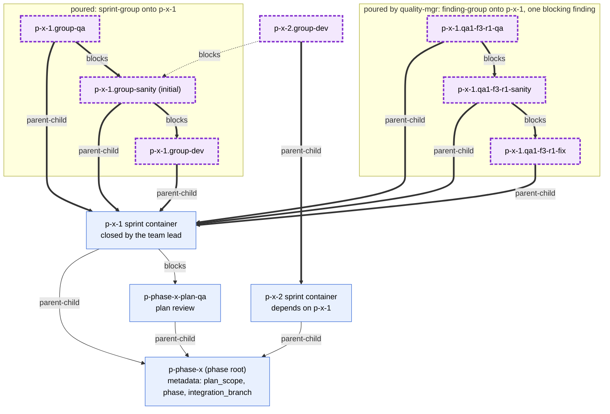
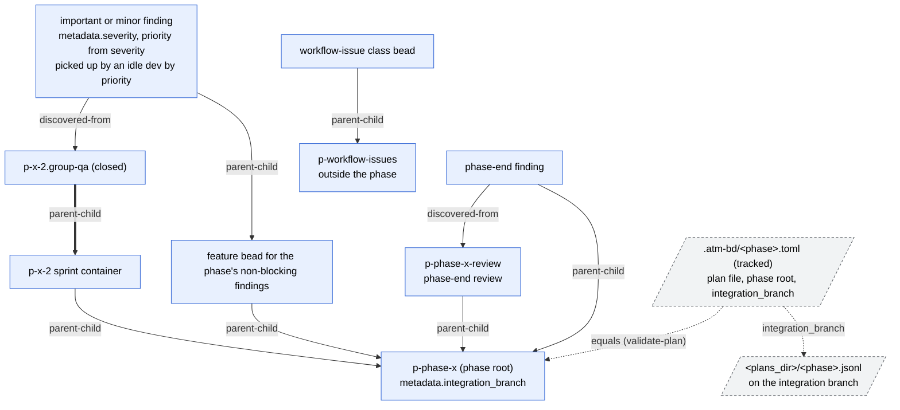

# Phase level

The plan import creates the phase root and the sprint containers from
templates. `scripts/bead-groups` then pours each sprint's group and adds the
post-pour edges (formula.md); it runs after planning and before plan review.
When QA fails, quality-mgr pours one fix group per blocking finding under the
sprint before it closes qa. Important and minor findings sit at phase level.

## Root, sprint containers and cross-sprint edges

A dependency is drawn only where the dependent sprint needs the
predecessor's API. The dependent dev bead `blocks` on the predecessor's
initial sanity bead, so it starts once the predecessor's code passes its first
sanity check; fix groups do not affect it. An edge to the predecessor's sprint
container is added only on the user's request. `bead-groups` reads the
predecessors from the phase's plan file `<plans_dir>/<phase>.jsonl`.

## Phase-wide beads and non-blocking findings

quality-mgr creates important and minor finding beads from
`finding-bead.json.j2` before it closes the qa bead that found them. They are
never children of a sprint, so they never hold one open.
