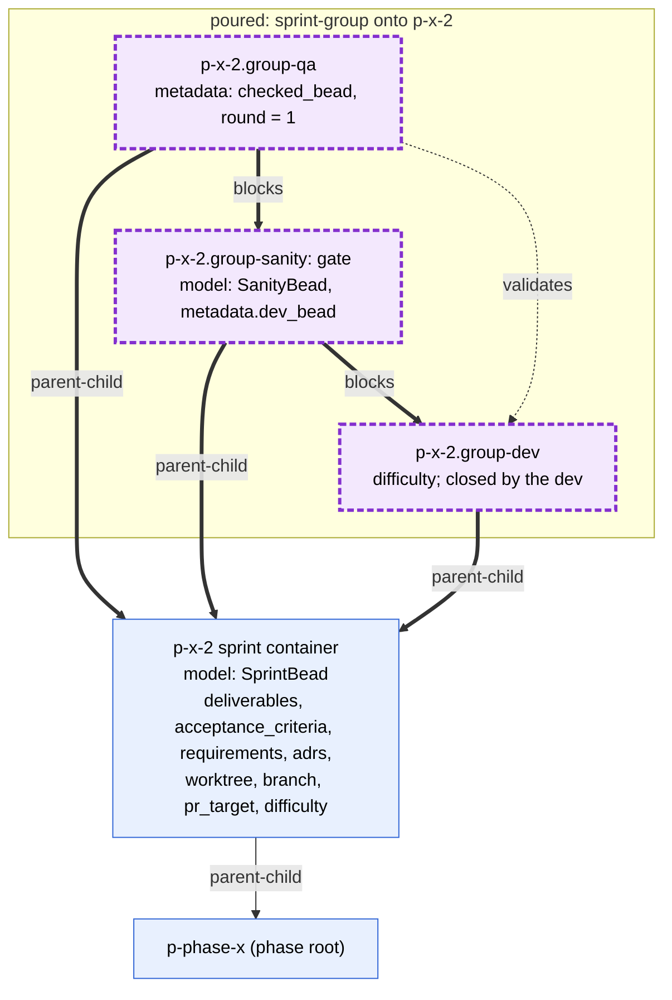
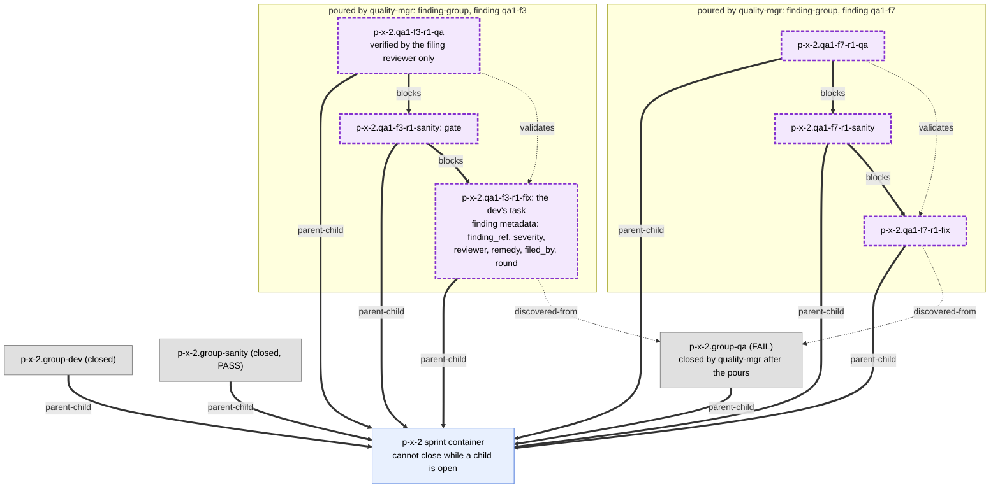
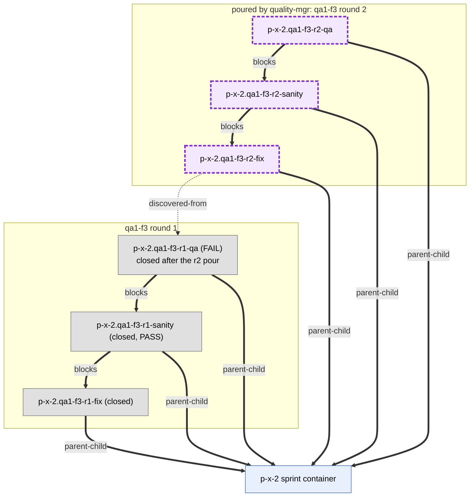
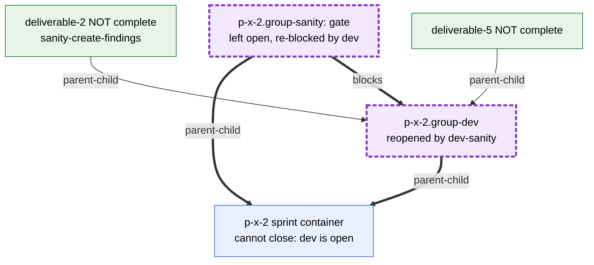

# Sprint level

The sprint bead is a container. Its own group is three sibling children,
`dev ← sanity ← qa`: sanity blocks on dev, qa blocks on sanity. Each blocking
finding pours the same shape, `fix ← sanity ← qa`, as siblings directly under
the sprint; there is no finding container. The fix bead is the dev's task and
carries the finding's metadata. bd refuses to close the sprint while any child
is open.

| Bead | Closed by | When |
| --- | --- | --- |
| dev, fix | the dev | the work is committed |
| sanity | dev-sanity | PASS only. On FAIL it reopens the dev or fix bead and leaves sanity open; the `blocks` edge re-blocks sanity |
| qa | quality-mgr | after it has poured a fix group for each blocking finding and created the important and minor finding beads |
| sprint | the team lead | every blocking fix group is closed |

## The sprint group

Sanity to dev carries `blocks`, so reopening dev re-blocks sanity. QA to dev is
a different pair from QA to sanity, so QA also `validates` the bead it checks.

## QA FAIL: one fix group per blocking finding

Groups share no edges: one finding, one fix. Fix verification is done only by
the finding's filing reviewer, locked to that finding. If two fixes must land
in order, a `blocks` edge between the two fix beads says so.

## A second fix round: a new group, never a reopen

A failed fix qa is handled like any failed qa: quality-mgr pours the next
round's group with `round = n+1`, then closes the failed qa. No earlier round
is reopened.

## Sanity FAIL

The sanity bead is a minimal gate with no `discovered-from` edge. On FAIL
dev-sanity files one child finding per undone deliverable under the checked
bead, reopens it, and leaves sanity open. The open children hold the dev bead
open, and the dev bead holds the sprint open. The dev fixes them for
the reopened bead on a new layer cut from the stack's top (`dev-fix.xml.j2`). The same applies to a fix bead and its
sanity.

dev-sanity is one teammate (`agents/dev-sanity.md`) that spawns
`sc-sanity-llm` and `sc-sanity-jev`, owns the verdict, reruns a failed
reviewer, and triages LLM/JEV disagreement.
