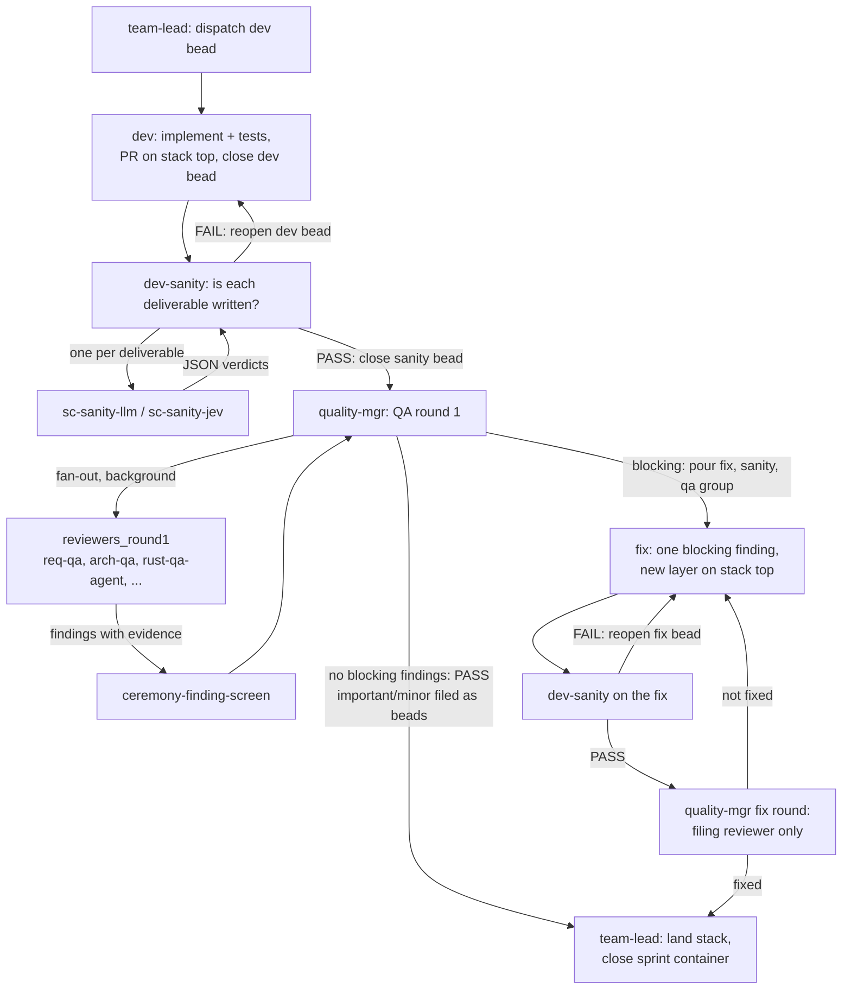
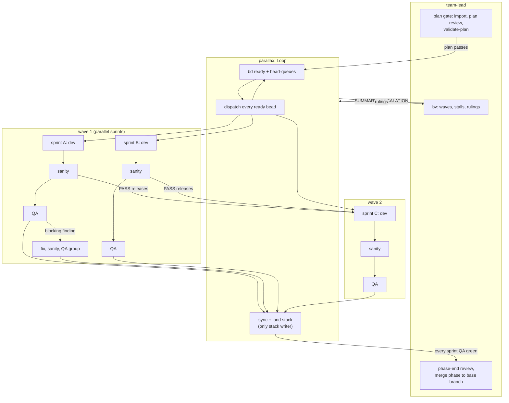

# Role Requirements

One file per agent, with its subagents and scripts: what it does, when, in what order. Each file has `Requirements` (checked against the package sources) and `Unresolved` (package sources that contradict each other). A prompt line that maps to no requirement goes to review: the requirement may be missing.

| File | Agent |
| --- | --- |
| [dev.md](dev.md) | dev, dev-fix, fix; `assignment-gates.py` |
| [dev-sanity.md](dev-sanity.md) | dev-sanity with sc-sanity-llm, sc-sanity-jev; sanity scripts |
| [quality-mgr.md](quality-mgr.md) | QA, plan review, phase-end review; reviewers, ceremony screen |
| [planner.md](planner.md) | design to beads; `validate-plan` |
| [team-lead.md](team-lead.md) | sequencer; swarm-master (none in the package) |
| [parallax.md](parallax.md) | work-orchestrator teammate (optional) |

## Who does what

| Agent | Responsible for |
| --- | --- |
| **team-lead** | Runs the phase. Imports the plan into beads, gets it through plan review, dispatches every ready bead as an ATM task, and is the only writer of the gh stack. Lands the stack, runs the phase-end review, and merges the phase. Makes the rulings and escalates to the user. |
| **parallax** (optional) | The lead's work-orchestrator. Runs the routine loop for the lead: dispatches ready beads, syncs, and lands the stack. Sends the lead only summaries and escalations. The lead keeps the graph analysis (`bv`), rulings, gates, phase closure and the merge. |
| **planner** | Turns a design into a phase plan in beads: a phase root, sprint containers, `owned_paths`, and the dependencies between sprints. Cuts sprints for the shortest critical path, and `validate-plan` must pass before import. |
| **dev** (dev, dev-fix, fix) | Implements one bead on its own branch with tests and opens a PR on the top of the stack. Works through a private checklist, one deliverable at a time, then closes the bead and the task with the pushed head. A fix bead does the same for one blocking finding. |
| **dev-sanity** | Checks a closed dev or fix bead at its pinned commit: is each numbered deliverable written, and does lint pass? Spawns one checker per deliverable (`sc-sanity-llm`, plus `sc-sanity-jev` when Jev is available) and merges their results. PASS closes the sanity bead. FAIL reopens the dev bead and files a finding for each deliverable that is not done. Not QA: it never judges quality. |
| **sc-sanity-llm / sc-sanity-jev** | dev-sanity's subagents. Each answers "is this deliverable written?" for one deliverable, as JSON. They are read-only and make no bead writes. |
| **quality-mgr** | Runs QA on a bead whose sanity check passed. Fans out to the repository's round-1 reviewers in the background, re-verifies every cited line, and screens the findings for ceremony. Pours a fix, sanity and QA group for each blocking finding, and files important and minor findings as beads. In a fix round only the reviewer that filed a finding verifies its fix. Also runs plan review and the phase-end review. |
| **reviewers** (`reviewers_round1`, for example req-qa, arch-qa, rust-qa-agent) | quality-mgr's subagents. Each reviews the change from one angle and returns findings with file and line evidence. |
| **ceremony-finding-screen / ceremony-qa** | Flags findings (and, in plan review, plan content) whose remedy is a process artifact with no consumer, so it is closed instead of built. |

## Dev / fix loop (one sprint)

Every arrow into an agent is the lead (or parallax) dispatching the bead that `bd ready` lists. bd's edges decide the order: sanity waits on dev, QA waits on sanity.

## Wave orchestration with parallax

The lead hands routine dispatch to parallax and keeps the plan gate, `bv`, rulings and phase closure. A dependent sprint's dev bead waits on its predecessor's **sanity** bead, not its QA. The next wave starts once the code is known to be written, while QA of the previous wave runs in parallel.

